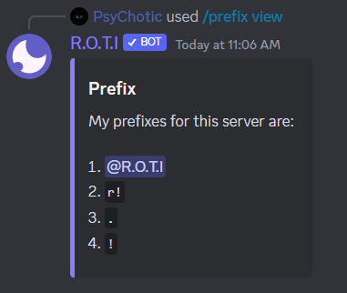
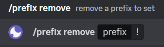

# Customizing Prefix

Are you curious about the meaning of "bot prefix" and how to use it? No need to worry, we've got you covered. This guide will provide you with everything you need to know about bot prefixes and how to customize them for R.O.T.I.

## What is prefix ?

A Discord bot prefix is a character or set of characters that are used to distinguish commands for a bot from normal chat messages. When a user wants to issue a command to a bot, they type the prefix followed by the command. For example, if the prefix is "!", a user might type "!help" to get a list of available commands from the bot.

The use of a prefix helps to avoid confusion between normal chat messages and bot commands, and ensures that the bot only responds to messages that are intended as commands.

## Default prefix

The default prefix for R.O.T.I is [ r! ], but it can be customized to your preference. Therefore, it can be easily changed according to your needs.

## Adding a new prefix

- To add a new prefix for R.O.T.I, use the command `/prefix add <your prefix>` and press enter.

## List of added prefixes

- To view the list of added prefixes for R.O.T.I, use the command `/prefix view` and press enter.

## Removing an existing prefix

- To remove an existing prefix for R.O.T.I, use the command `/prefix remove` and press enter.

## Conclusion

To summarize, you can add a new prefix for R.O.T.I using the command `/prefix add`, view the list of added prefixes with the command `/prefix view`, and remove an existing prefix using the command `/prefix remove`. Use these commands to customize your experience with the R.O.T.I bot on your Discord server.
