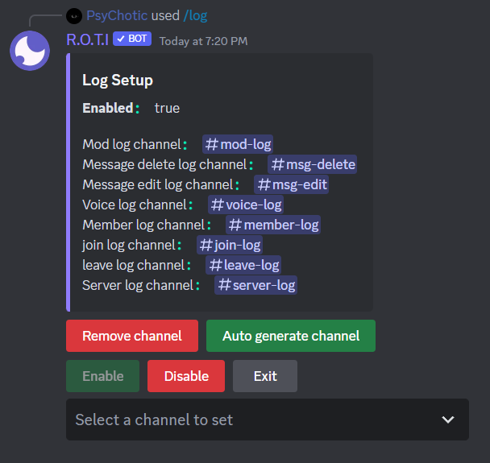
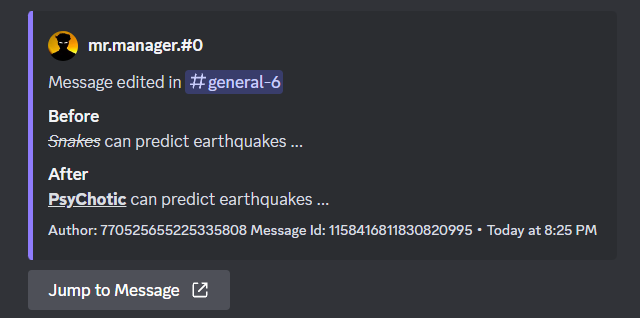
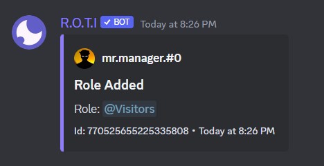
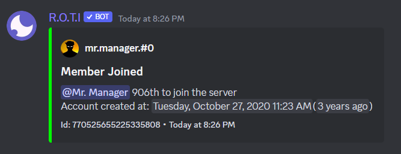

# Logging

The Logs category includes commands for tracking various types of activity within the server. These logs can provide valuable insights into server usage, member behavior, and more. Overall, the Logs category provides valuable tools for server owners and moderators to gain insights into their community and ensure a safe and engaging environment for all members.

## Commands

| Command | Description                                   |
| ------- | --------------------------------------------- |
| /log    | Configure logging of various events of server |

## Configuration

To configure log channels, use the `/log` command. Logs can help moderators maintain accountability, monitor user behavior, troubleshoot technical issues, and more.

## Automatic Setup

Log channels can be easily set up by auto-generating them, which can be found after using the `/log` command. This feature saves time and effort by automatically generating and setting up the channels.

Alternatively, you can select a different log channel or an existing one by clicking on the bottom menu labeled [`Select a channel to set`].

## Type of Logs

There are eight types of logs that can be set up in a Discord server.

Which include Mod log, Message delete log, Message edit log, Voice log, Member log, Join log, Leave log, and Server log. These logs record various events in the server such as actions taken by moderators, deleted or edited messages, voice chat activity, changes to user accounts, user joins and leaves, server settings, and more. These logs help moderators keep track of important events, maintain accountability, identify and address inappropriate behavior, troubleshoot technical issues, and ensure that the server is functioning properly.

### Mod log

Records actions taken by moderators, such as when they kick or ban a user. The mod log helps the server staff keep track of important events and maintain accountability.

### Message delete log

Records when messages are deleted on the server. It provides a record of what was said and by whom, and can help moderators identify and address inappropriate behavior.

### Message edit log

Records when messages are edited on the server. It can help moderators monitor changes to messages and ensure that conversations remain civil and on-topic.

### Voice log

Records voice chat activity, such as when users join or leave voice channels. It can help moderators monitor voice channels for inappropriate behavior, and assist with troubleshooting any technical issues.

### Member log

Records changes to user accounts, such as when they change their nickname or when their role is modified. It can help moderators keep track of user activity and ensure that users are following server rules and guidelines.

### Join log

Records when new users join the server. It provides server staff with important information about who is joining the community, and can help moderators welcome new users and provide them with any necessary information or support.

### Leave log

Records when users leave the server. It can help moderators keep track of who is leaving the community and identify any patterns or issues that may need to be addressed.

### Server log

Records changes to the server itself, such as when new channels or roles are created, or when server settings are updated. It can help moderators ensure that the server is properly configured and functioning as intended, and can also provide important information for troubleshooting any technical issues.

