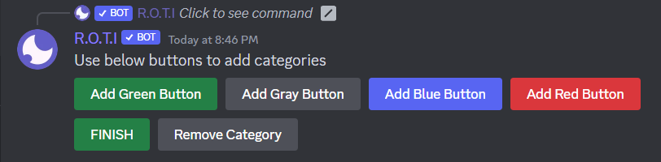
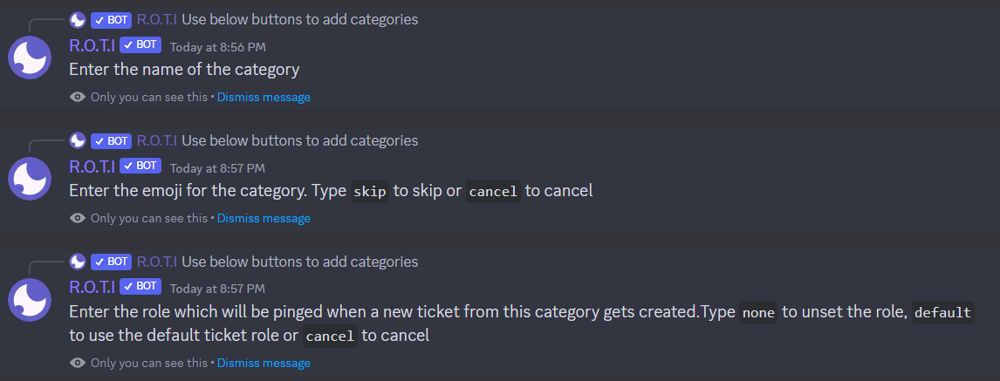
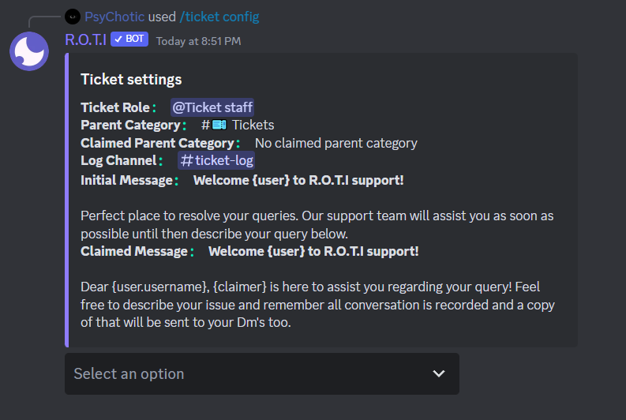
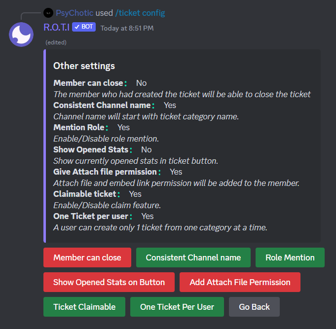

# Ticket System

The Ticket system offers commands and features to establish and oversee support tickets on your server. Its purpose is to simplify the creation of a dedicated support system for server owners, allowing them to effectively handle and address inquiries from their members. By utilizing this category, you can implement a comprehensive ticketing solution that enhances the efficiency of your support system. With a variety of commands and configuration options available, you can optimize your ticket management process. Let's delve into each command and configuration in greater detail to gain a comprehensive understanding.

## Commands

The Tickets category offers a range of commands, including:

| Command             | Description                                       |
| ------------------- | ------------------------------------------------- |
| /ticket setup       | Sets up the support ticket system                 |
| /ticket config      | Configures the support ticket system              |
| /ticket add         | Add a user or role to support ticket              |
| /ticket remove      | Remove a user or role from support ticket         |
| /ticket close       | Closes an open support ticket                     |
| /ticket rename      | Renames an existing support ticket                |
| /ticket stats       | Displays statistics for the support ticket system |
| /ticket leaderboard | Shows the top users with the most closed tickets  |

## Set up Ticket panel

The Ticket Setup command is used to create a ticket panel for generating support tickets in your server. This command provides a user-friendly interface to set up and customize the ticket panel according to your preferences. Let's explore how to use this command effectively:

**Command Usage:**

```
/ticket setup [channel]
```

The channel argument is optional. If you choose not to specify a channel, the ticket panel creation process will be initiated in the same channel where the command is used.

### Embed creation

After entering the command, an embed creation interface will be displayed. In this interface, you can customize the appearance of the ticket panel by setting the desired colors, titles, and descriptions for the buttons.


Once you have created the embed, click on the "**Save & Set Category**" button. This action will save the embed configuration and prompt the creation of category buttons for managing the ticket panel. These buttons include options such as adding green, gray, blue, or red buttons, finishing the setup, or removing a category.

### Category buttons

The category buttons in the ticket panel allow users to select the appropriate category when creating a new ticket. Each category represents a specific type of support or inquiry, enabling users to categorize their tickets effectively.

After saving the embed configuration in the Ticket Setup command, you will be prompted to add category buttons. These buttons represent different ticket categories. To add a category button, click on one of the available options, such as "**Add Green Button**", "**Add Gray Button**", "**Add Blue Button**" or "**Add Red Button**" Select the option that best matches the category you want to create.



A new category button will be added to the ticket panel. By clicking on this button, users will be able to create a ticket under the corresponding category.

#### Configuring Category Details

Once you have clicked on a category button, you can customize its details, including the category name, emoji, and the role that should be notified when a new ticket is created under that category.

- **Name:** Enter the desired category name using clear and descriptive terminology that accurately represents the type of ticket it represents.

- **Emoji:** Select an emoji that best represents the category. This emoji will appear alongside the category name on the ticket panel button.

- **Role:** Specify the role that should be notified when a new ticket is created under that category. This role will receive notifications to ensure the appropriate staff members are alerted to new tickets in the specific category.

Repeat these steps for each category button you have added to the ticket panel, configuring the details according to your server's specific needs.

**During the setup process, you have a few additional options:**



- Typing "**cancel**" will cancel the category adding process.

- Typing "**skip**" will skip the emoji step.

- Typing "**none**" will indicate that no role should be notified for that particular category.

- Typing "**default**" will use the role specified under the `/ticket config` command to be notified for that category.

### Removing Category Buttons

If you need to remove a category button from the ticket panel, follow these steps:

- Click on the "Remove Category" button in the ticket setup interface.

- A selection menu will appear, displaying all the existing category buttons.


- Choose the category button you wish to remove from the panel.

- Confirm your selection, and the chosen category button will be removed from the ticket panel.

```
Alternatively, if you click "Finish," the ticket panel setup process will be completed.
```

By following these steps, you can easily set up and configure a ticket panel that suits your server's needs, providing an organized and efficient support ticket system.

## Ticket Configuration

The Ticket Config command allows you to configure various settings and parameters for the ticket system. With this command, you can customize the ticket role, parent category, claimed tickets parent category, log channel, initial message, and claimed message. Let's explore each configuration option in detail:

**Command Usage:**

```
/ticket config
```



### Configuration Options

**1. Ticket Role:**

This option allows you to set the role that has access to handle tickets.
Specify the desired ticket role by mentioning the role or role ID in the channel.

**2. Parent Category:**

The parent category is the main category under which new tickets will be created.
Choose the parent category where you want new tickets to be placed.

**3. Claimed Parent Category:**

Specify the parent category where claimed tickets will be moved when a staff member claims a ticket.
This helps to keep the ticket channels organized and separate from the main category.

**4. Log Channel:**

The log channel is where ticket-related activity and transcripts will be logged.
Set the log channel to receive updates and keep track of ticket actions.

**5. Initial Message:**

Customize the initial message that appears in each new ticket channel.
This message can include information about ticket guidelines or instructions for users.

**6. Claimed Message:**

Customize the message that appears in the ticket channel after it has been claimed by a staff member.
This message can provide reassurance to users that their ticket is being attended to.

### Advanced Configuration Options

In addition to the basic configurations, the Ticket Config command also offers advanced options. To access advanced configuration options, please click on the selection menu and choose "**Advanced Configuration**" This will allow you to access a range of advanced settings and configurations.



**1. Member Can Close:**

Enabling this option allows members to close their own tickets when they feel their issue has been resolved.

**2. Consistent Channel Names:**

This option automatically updates ticket channel names based on the selected ticket category, providing consistency and organization.

**3. Mention Role:**

When creating a new ticket, the role specified in the ticket configuration will be automatically mentioned. This ensures that the appropriate staff members are promptly notified and made aware of the new ticket.

**4. Show Opened Stats:**

This option displays the number of currently open tickets on the ticket creation buttons in the ticket panel, providing transparency to both users and staff.

**5. Give Attach File Permission:**

Automatically grant the ticket creator permission to attach files and embed links within their ticket messages.

**6. Claimable Ticket:**

Enabling this option adds a "Claim" button that can only be clicked by ticket staff. When claimed, a green tick (✅) will be added to the ticket channel name, and the initial message will be replaced with the claimed message. If a claimed parent category is specified, the ticket will be moved there.

**7. One Ticket Per User:**

This option limits users to creating only one active ticket at a time for each category.

## Adding a member

The `/ticket add` command allows staff members to add other members to an existing ticket. If you require additional input or collaboration from a specific member, simply mention them using this command. They will be included in the ongoing ticket conversation, ensuring effective communication.

**Command Usage:**

```
/ticket add [target] [channel]
```

## Removing a member

The `/ticket remove` command enables staff members to remove other members from a ticket. If a member's involvement is no longer necessary or relevant to the ticket discussion, you can use this command to remove them. Mention the member you want to remove, and they will be excluded from the ticket channel.

**Command Usage:**

```
/ticket remove [target] [channel]
```

:::note
You have the flexibility to add or remove a specific role, rather than just individual members.
:::

## Closing Ticket Channels

The Ticket Close command is used to officially close a ticket in the ticket system. This command allows staff members to mark a ticket as resolved and finalize the support process. Let's explore how to use the Ticket Close command effectively:

**Command Usage:**

```
/ticket close [channel] [reason]
```

- The `channel` argument is optional and represents the specific ticket channel you want to close. If not provided, the command will be executed for the current channel.

- The `reason` argument is also optional and allows you to provide a reason for closing the ticket. This reason can help provide context and closure to the ticket creator.

## Renaming Ticket Channels

The Ticket Rename command allows you to change the name of a ticket channel. This command provides the flexibility to update the channel name to better reflect the ticket's purpose or current status. Let's explore how to use the Ticket Rename command effectively:

**Command Usage:**

```
/ticket rename [name] [channel]
```

The **name** argument represents the desired new name for the ticket channel. To rename a ticket channel, follow these steps:

- Identify the ticket channel you want to rename within your server.

- Use the `/ticket rename` command and specify the desired new name as the "name" argument.

- Execute the command, and the ticket channel's name will be updated with the provided new name.

### Best Practices for Renaming

When renaming ticket channels, consider the following best practices:

- Choose a name that clearly reflects the purpose or topic of the ticket.
- Use descriptive and concise wording to ensure easy identification.
- Avoid using special characters or symbols that may cause confusion.
- Update the name to reflect any significant changes in the ticket's status or focus.

## Ticket Statistics

The Ticket Stats command provides valuable statistics and insights into the ticket system. By using this command, you can gain an understanding of the ticket activity and performance within your server. Let's explore the different statistics provided by the Ticket Stats command:

**Command Usage:**

```
/ticket stats
```

The Ticket Stats command provides the following information:

#### Number of Tickets Created:

- This statistic displays the total number of tickets that have been created in the server since the ticket system was implemented. It gives an overview of the ticket volume and engagement.

#### Number of Currently Open Tickets:

- This statistic shows the count of tickets that are currently open and awaiting resolution. It gives an overview of the pending ticket workload.

#### Number of Tickets Claimed:

- This statistic represents the total count of tickets that have been claimed by staff members. It helps track the involvement and workload of the ticket staff.

#### Number of Tickets Closed:

- This statistic indicates the total count of tickets that have been closed. It provides insights into the number of resolved or completed tickets.

#### Average Time Taken for Tickets:

- This statistic calculates the average duration it takes to close a ticket. It provides insights into the efficiency and responsiveness of the ticket resolution process.

## Ticket Leaderboard

The Ticket Leaderboard command allows you to view the number of tickets closed by each staff member in the ticket system. This feature provides a way to track and recognize the contributions of your staff members in resolving support tickets.

**Command Usage:**

```
/ticket leaderboard
```

### Viewing the Leaderboard

By executing the `/ticket leaderboard` command, you can access the leaderboard that displays the number of tickets closed by each staff member. This information helps you identify the most active and effective contributors in your support team.

The leaderboard presents the staff members' names and the corresponding count of tickets they have closed. The staff member with the highest ticket closure count will be ranked at the top of the leaderboard.

### Utilizing the Leaderboard

The Ticket Leaderboard provides valuable insights into the performance and productivity of your staff members. By regularly checking the leaderboard, you can:

- Recognize and appreciate the efforts of top-performing staff members.
- Identify staff members who may require additional support or training.
- Evaluate the overall performance and effectiveness of your support team.

## <span className="txp">Conclusion</span>

In conclusion, the ticket system in R.O.T.I provides a comprehensive solution for managing support requests in your Discord server. With commands for adding, removing, and renaming tickets, setting up ticket panels, configuring ticket settings, and generating statistics, you can efficiently handle support inquiries. The system allows for customization and offers features such as leaderboards and ticket closure with transcripts. Enhance your server's support experience with R.O.T.I's versatile ticket system.
