import { Steps } from 'nextra/components'
import { Callout } from 'nextra/components'

# Embeds

Discord embeds are a powerful way to transform plain text into visually striking and informative content blocks. R.O.T.I's Embed Builder gives you incredible control over their design, catering to both beginners with an intuitive interface and advanced users seeking flexible customization.

## Commands

|   Command    |            Description            |                Usage                |
| :----------: | :-------------------------------: | :---------------------------------: |
|    /embed    |          Create an embed          |         `/embed [channel]`          |
|  /editembed  |      Edit an existing embed       |      `/editembed [message_id]`      |
| /sourceembed | Get JSON source code of any embed |     `/sourceembed [message_id]`     |

## Embed Builder

<Steps>
### Initiating the Builder

To start creating your embed, use the `/embed` command. If you include a channel name, the finished embed will be automatically sent there.

```bash filename="Usage"
/embed [channel]
```
<Callout emoji="📌">
The embed builder interface will be active for 10 minutes. Make any desired changes and finalize your embed within this time frame.
</Callout>

### Core Customization

- `Title`: The bold headline of your embed, grabbing attention.
- `Description`: The main message. Think of it like the body of a short announcement or post.
- `Color`: Choose a hex color code (e.g. #7fb366) or color name (e.g. green, white, red) to make your embed stand out with a vibrant side stripe.
- `Image`: Include a main image to capture attention and illustrate your content.
- `Thumbnail`: Add a smaller, complementary image for extra visual appeal.

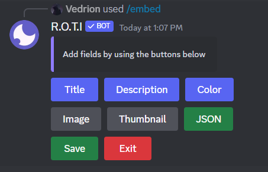

### JSON for Fine-Tuning

JSON (JavaScript Object Notation) is a structured language for storing data. It is a way to represent data in a structured format that's easy for both humans and computers to read. It uses a format like this:

```json copy
{ "key": "value", "anotherkey": "anothervalue" }
```

Embeds are essentially data, and JSON defines their structure. Think of it like a recipe card for your embed, it lists ingredients (title, color, etc,) and their values.

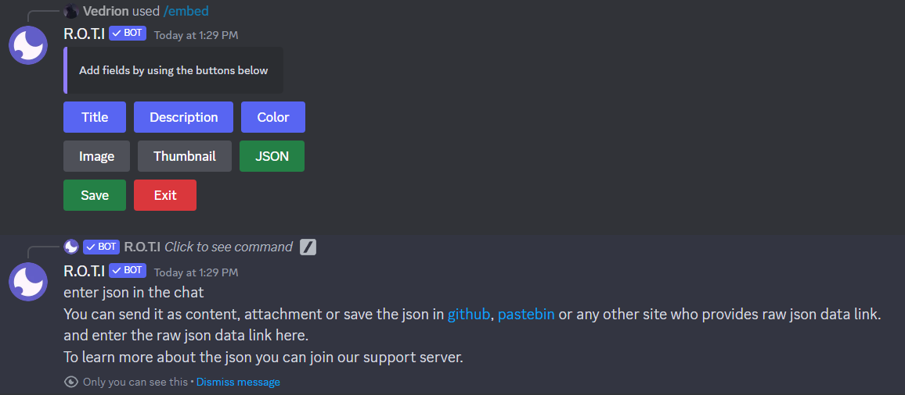

R.O.T.I's JSON option lets you directly manipulate the code of your embed. This means you can:

- `Fields`: Create multiple sections within your embed, each with a title and content. This is perfect for organized information or lists.
- `Author`: Display an author name, link, and even a small author icon.
- `Footer`: Add small text at the bottom, ideal for timestamps, credits, or additional notes.

#### How to use JSON

- `Paste It In`: Directly place your JSON code into the message field in the current channel.

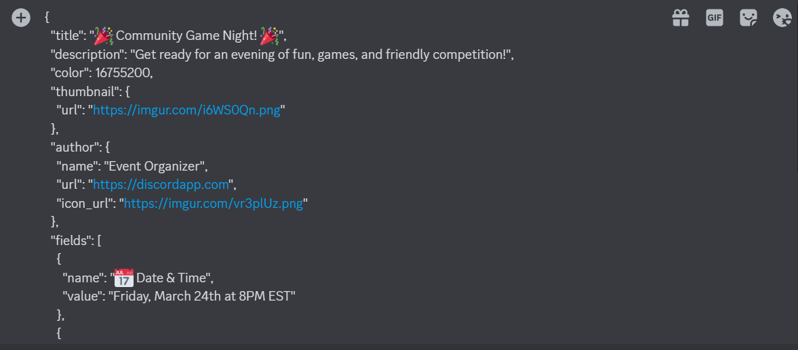

- `External Link`: For lengthy or complex JSON, provide a link to a file containing your code (due to Discord's character limits).

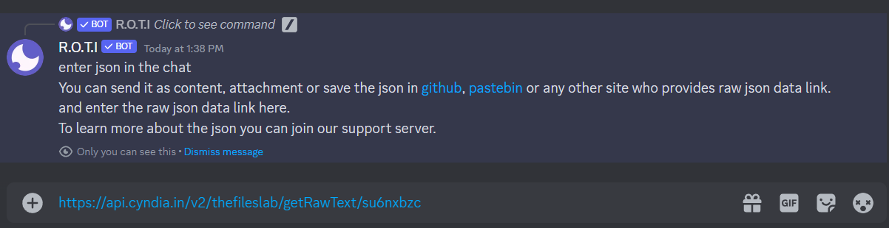

#### Example

```json copy
{
  "title": ":tada: Community Game Night! :tada:",
  "description": "Get ready for an evening of fun, games, and friendly competition!",
  "color": 16755200,
  "thumbnail": {
    "url": "https://imgur.com/i6WS0Qn.png"
  },
  "author": {
    "name": "Event Organizer",
    "url": "https://discordapp.com",
    "icon_url": "https://imgur.com/vr3plUz.png"
  },
  "fields": [
    {
      "name": ":date: Date & Time",
      "value": "Friday, March 24th at 8PM EST"
    },
    {
      "name": ":video_game: Featured Games",
      "value": "- Among Us\n- Gartic Phone",
      "inline": true
    },
    {
      "name": ":trophy: Prizes",
      "value": "Bragging rights and maybe some surprises :wink:",
      "inline": true
    }
  ],
  "image": {
    "url": "https://imgur.com/DFtKVhe.png"
  },
  "footer": {
    "text": "Brought to you by the Community Events Team"
  }
}
```

Output:

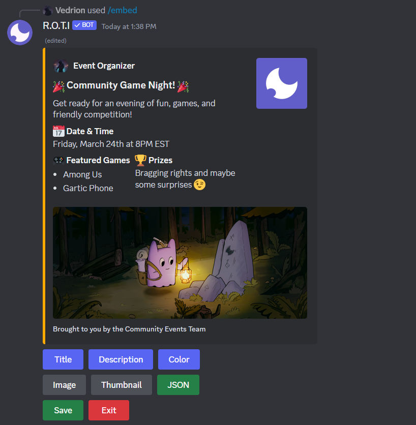

### Enhancing Your Embed

#### Add Link Buttons

Guide users to websites or other Discord channels with clickable buttons directly within your embed.

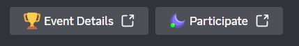

**Link Button Customization**

- `Label`: This is the clickable text displayed on the button itself. Keep it short and descriptive (e.g., "Learn More," "Join Now," etc.).

- `Emoji`:  An optional small image to add visual interest to your button. You can use standard emojis, server-specific emojis, or even custom emojis  uploaded to your Discord server.

- `URL`:  The destination website link. When users click the button, they'll be redirected to this URL. Ensure it's a valid and relevant website.

#### Send as Webhook

Disguise your embed's origin! Send it with a custom name and avatar, excellent for themed announcements.

**Webhook Customization**

- `Username`: The name that will appear as the sender of your webhook message. This can be anything you like, making it perfect for themed messages.

- `Avatar URL`:  A direct image link that will serve as the profile picture for your webhook message. This adds another layer of customization.

You can also mention a user (e.g. @vedrion) to dynamically use their profile picture.

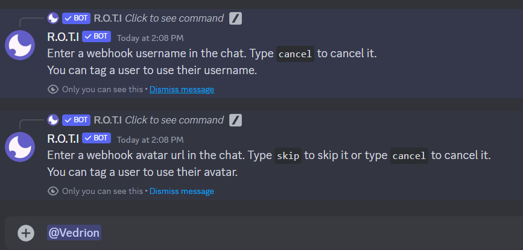

### Finish and Send

Finalize your masterpiece and dispatch it to your chosen channel.

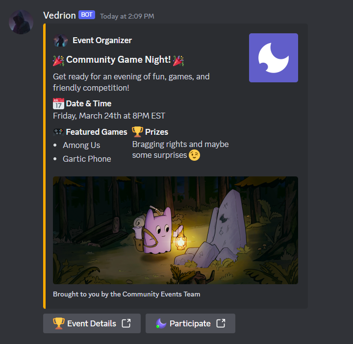
</Steps>

## Editing Embeds

This command opens the embed builder interface with the selected embed's details pre-filled, allowing you to modify the content and appearance of an existing embed you've previously sent, and make any desired changes.

```bash filename="Usage"
/editembed [message_id]
```

`message_id`: The unique ID of the embed you want to change.

To obtain this, right-click the embed message and select "Copy ID." For more information, refer to [How to get a message ID on Discord](https://support.discord.com/hc/en-us/articles/206346498-Where-can-I-find-my-User-Server-Message-ID).

**Example:**

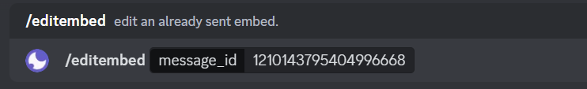

**Output:**

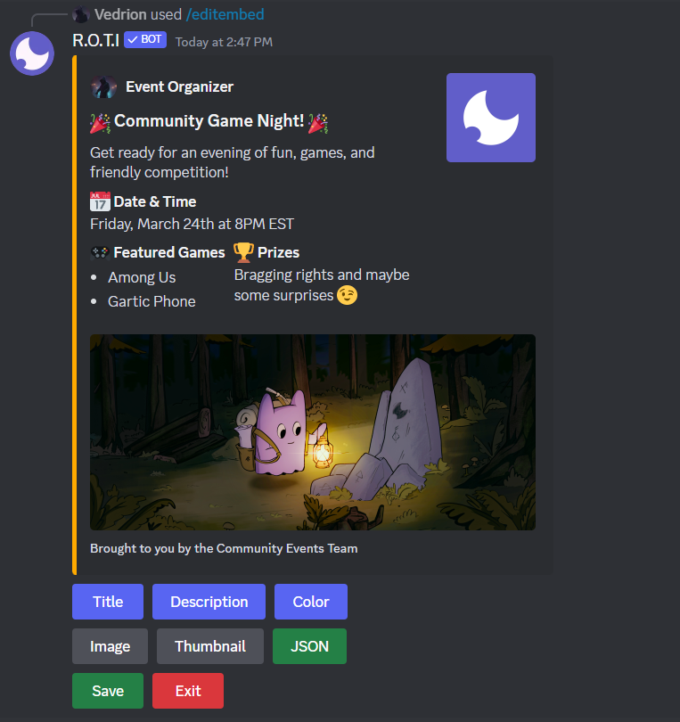

## Retrieve JSON Content

This command retrieves the raw JSON code defining the structure and content of a Discord embed. It supplies the underlying JSON data, enabling advanced users to modify embeds directly or enhance their understanding of the formatting.

```bash filename="Usage"
/sourceembed [message_id]
```
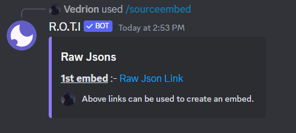

**Raw JSON**

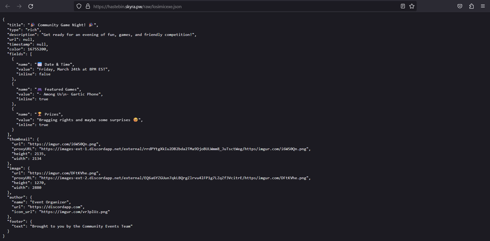

## <span className="txp">Conclusion</span>

R.O.T.I's embed builder gives you the power to transform your messages from simple text into visually engaging experiences. Organize information with clarity, create eye-catching visuals, and bring your ideas to life in a way that stands out within your Discord community. Whether you want to share important updates, add structure to server rules, or simply express yourself with color and style, R.O.T.I's embeds provide endless possibilities.