import { Steps } from 'nextra/components'
import { Callout } from 'nextra/components'

# Self-Assignable Roles

Drive engagement and optimize server organization by implementing self-assignable roles. Empower members with user-friendly options to pick roles that suit them, minimizing the reliance on manual role assignments.

## Commands

| Command                 | Description                                                            | Usage                                                             |
| ----------------------- | ---------------------------------------------------------------------- | ----------------------------------------------------------------- |
| /buttonrole             | Create a button that assigns a role to a user when clicked             | `/buttonrole [channel] [type]`                                    |
| /selectrole             | Create a dropdown menu that allows users to assign themselves a role   | `/selectrole [channel] [type]  [require_role_type] [placeholder]` |
| /reactionrole add       | Add a role to a message that can be assigned to users when reacted     | `/reactionrole add [message_id] [channel]`                        |
| /reactionrole remove    | Remove a reaction role that was previously assigned through a reaction | `/reactionrole remove [message_id] [emoji] [channel]`             |
| /reactionrole removeall | Remove all reaction roles that were assigned through reactions         | `/reactionrole removeall  [channel] [message_id]`                 |

## Create Button Roles

Button roles provide a dynamic and user-friendly way for members of your Discord server to assign themselves roles.  With button roles, you can create clickable buttons within specific channels that, when interacted with, add or remove roles from the user. This empowers users to self-manage their server experience and keeps role assignment organized.

```bash filename="Usage"
/buttonrole [channel] [type]
```
Options:

- `[channel]`: The text channel where you want the button role to be displayed.

- `[type]`: Choose the behavior of the button role (Unique, Verify, Reversible).

### Type of Button Roles

<Steps>
#### 1. Unique

Allows a user to have only one role assigned.

#### 2. Verify

A role that cannot be removed by the user once assigned.

#### 3. Reversible (Default)

Allows a user to add a role and remove it by clicking the button again.
</Steps>

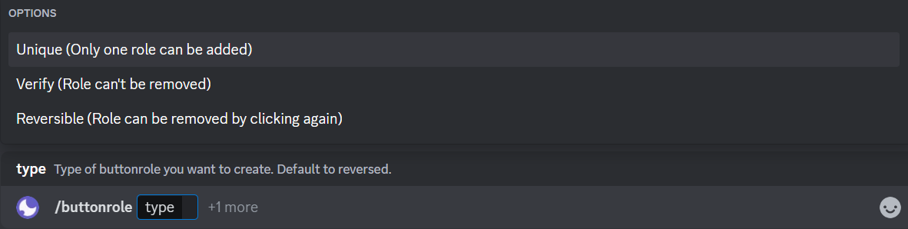

<Callout type="info">
The user can remove a role by clicking again on the button in both **Unique** and **Reversible**. The only difference is that in `Unique` the user can only pick one role, whereas in `Reversible` the user can pick one or more than one role.
</Callout>

### Setting Up Button Roles

Let's start the setup process to create button roles.

#### Embed Creation

Once you've executed the `/buttonrole` command with the options (**channel** and **type**), you'll be presented with an embed creation panel. Refer to the detailed embed creation guide [here](/basic-configuration/embeds).

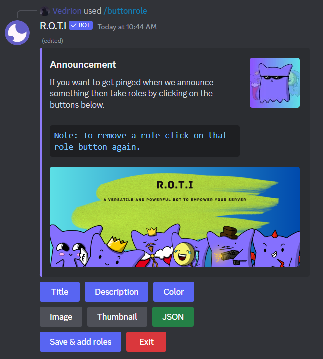

#### Adding Roles

After crafting your embed, click **Save & Add Roles**.  You'll have the following button choices:

- `Standard Buttons`: Green, Gray, Blue & Red buttons.
- `Link Button`: Directs the user to an external link.
- `Send/Send as Webhook`: Send button roles message either as the bot or as a webhook.

**Standard Buttons**

The primary function of standard buttons is to add or remove a designated role from a user upon button click. The color options in standard buttons add a visual organizational layer. There are four types of standard buttons.

- 🟩 Green Button
- 🔲 Gray Button
- 🟦 Blue Button
- 🟥 Red Button

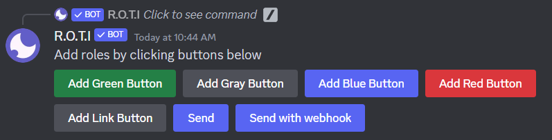

After selecting a button type, you'll need to:

<Steps>
##### Step 1 - Choose the Role

Designate the role to be assigned or removed.

##### Step 2 - Select an Emoji

Add an emoji to the button. Type `skip` to omit or `cancel` to abort.

##### Step 3 - Required Roles

Enter any roles required for a user to interact with the button and assign roles to themselves (space-separated).

##### Step 4 - Blacklisted Roles

Enter any roles that should prevent a user from interacting with the button (space-separated).
</Steps>

Once you've created the initial button role, you may want to add more button roles with different configurations. Follow the steps outlined above to add additional button roles.

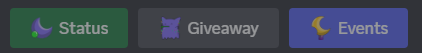

### Link Buttons

In addition to standard buttons, It also supports the creation of Link Buttons. Link Buttons are interactive buttons that redirect users to external links when clicked. This feature is particularly useful for providing quick access to external resources or websites directly from your Discord server.


### Final Steps

**Finishing the Setup:**

The **Send** button delivers the entire configured button role setup to the designated channel. This makes the embed you've designed, along with all its associated role assignment buttons, visible and interactive for users in that channel.

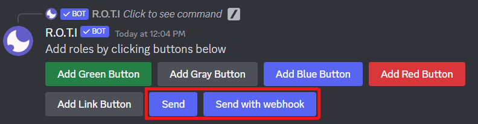

After clicking the `Send` button:

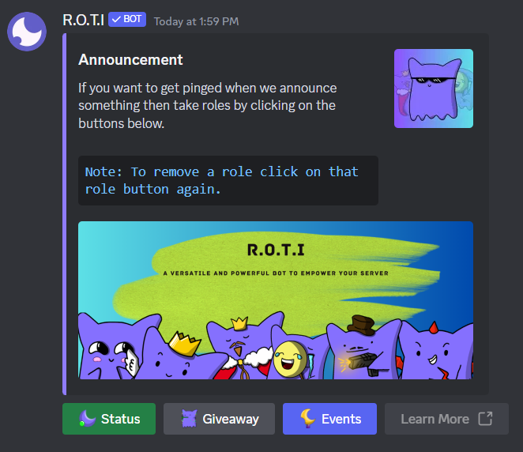

**Send as Webhook:**

The **Send as Webhook** button delivers the configured button role setup to the designated channel and allows you to customize how it appears.  Instead of the button role appearing as a standard R.O.T.I. bot message, it uses a temporary webhook to post with a specified name and profile picture.

For more details on webhooks, [click here](/basic-configuration/embeds#send-as-webhook).

## Create Dropdown Roles

The `/selectrole` command revolutionize user experience in your Discord server, providing an effortless way for members to self-assign roles through interactive dropdown menus. Select Roles promotes user customization and organization within the server.

```bash filename="Usage"
/selectrole [channel] [type] [require_role_type] [placeholder]
```

Options:

- `[channel]`: The text channel where you'd like to display the select role menu.
- `[type]`: Choose the behavior of the button role ([Unique](#type-of-button-roles), [Verify](#type-of-button-roles), [Reversible](#type-of-button-roles)).
- `[placeholder]`: The initial text displayed in the dropdown menu before a user makes a selection.
- `[require_role_type]`: Specifies how required roles impact who can interact with the menu.

**Type of Required Roles**

`Any One Of Them`: Users with at least one of the specified roles can use the menu to assign roles to themselves.

`All Of Them`: Users must have all of the specified roles to use the menu.

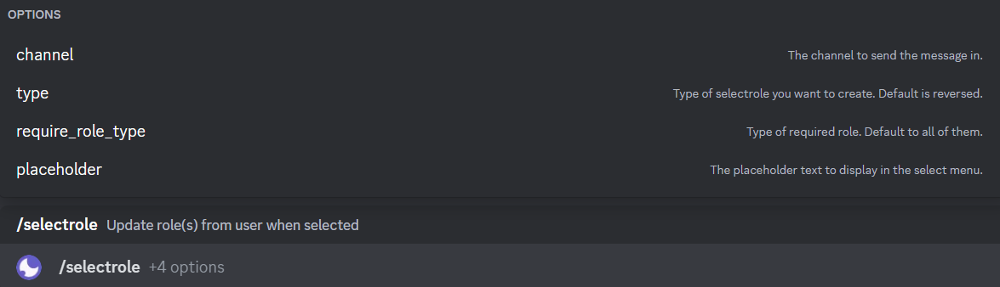

### Setting Up Dropdown Roles

Let's start the setup process to create a new dropdown select role menu.

#### Embed Creation

Once you've executed the `/selectrole` command with the options (**channel**, **type**, **require_role_type** and **placeholder**), you'll be presented with an embed creation panel. Refer to the detailed embed creation guide [here](/basic-configuration/embeds).

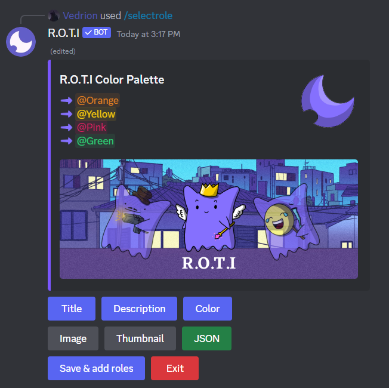

#### Adding Roles

After crafting your embed, click **Save & Add Roles**.  You'll have the following button choices:

- `Add Role`: Begin the process of adding roles to your select menu.
- `Save/Send as Webhook`: Send select role menu message either as the bot or as a webhook.

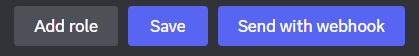

**How to Add Select Menu Role**

Click "Add Role" to start adding roles to your select menu. After clicking, you'll need to:

<Steps>
##### Step 1 - Choose the Role

Designate the role to be assigned or removed.

##### Step 2 - Select an Emoji

Add an emoji to the button. Type `skip` to omit or `cancel` to abort.

##### Step 3 - Required Roles

Enter any roles required for a user to interact with the select menu and assign roles to themselves (space-separated).

##### Step 4 - Blacklisted Roles

Enter any roles that should prevent a user from interacting with the select menu (space-separated).
</Steps>

Once you've created the initial select menu role, you may want to add more select menu roles with different configurations. Follow the steps outlined above to add additional select menu roles.

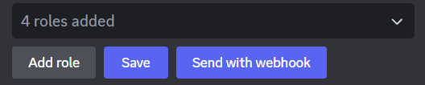

### Final Steps

**Finishing the Setup:**

The **Save** button delivers the entire configured select menu role setup to the designated channel, visible and interactive for users in that channel.

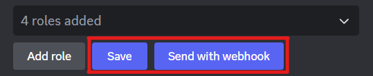

After clicking the `Save` button:

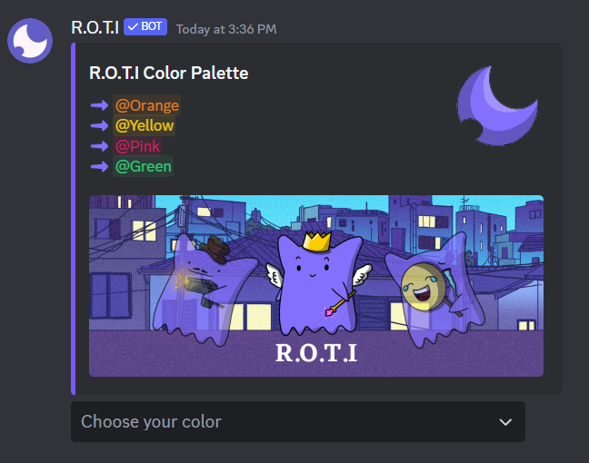

After clicking on `Choose your color`:

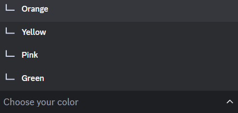

**Send as Webhook:**

The **Send as Webhook** button delivers the configured select menu role setup to the designated channel and allows you to customize how it appears.  Instead of the select menu roles appearing as a standard R.O.T.I. bot message, it uses a temporary webhook to post with a specified name and profile picture.

For more details on webhooks, [click here](/basic-configuration/embeds#send-as-webhook).

## Create Reaction Roles

Reaction roles let your server members assign or remove roles from themselves simply by reacting with specific emojis to designated messages. This creates a fun and interactive way for users to personalize their server experience.

```bash filename="Usage"
/reactionrole add [message_id] [channel]
```

Options:

- `[message_id]`: The unique ID of the message where reactions will trigger role assignments.
- `[channel]`: The text channel containing the message.

<Callout type="info">
Reaction roles can be added to any message, whether it's a regular text message or a rich embed.
</Callout>

### Setting Up Reaction Roles

Locate or create the message where you want users to react for roles.

Let's consider an example. Suppose I want to create reaction roles for this message. Right-click the message and select `Copy ID` to obtain its message ID.

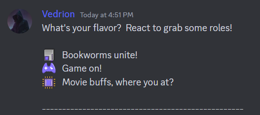

#### Adding Roles

<Steps>
##### Step 1 - Start with the Command

Use `/reactionrole add` command, specifying the message ID and the channel where the message is located.

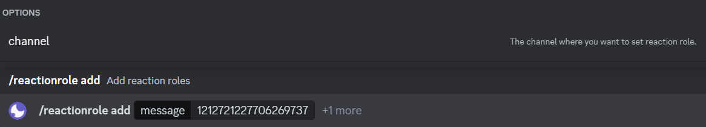

##### Step 2 - Begin Adding Roles

After executing the command, click on `Add role` to initiate the process of creating reaction roles.

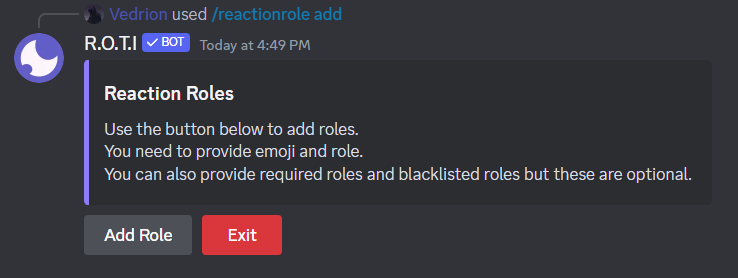

##### Step 3 - Add Your First Role-Emoji Pairing

- `Choose the Emoji`: Select the emoji that users will react with to gain the specified role.

- `Select the Role`:  Choose the role you want to be assigned when a user reacts with the chosen emoji.

<Callout emoji="📌">
You must provide the emoji first, followed by the role.
</Callout>

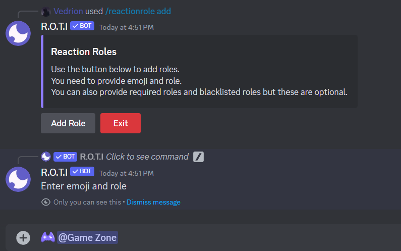

##### Step 4 - Manage Access (Optional)

- `Required Roles`: Specify which roles users must have to react.
- `Blacklisted Roles`: Specify any roles that should prevent a user from reacting.

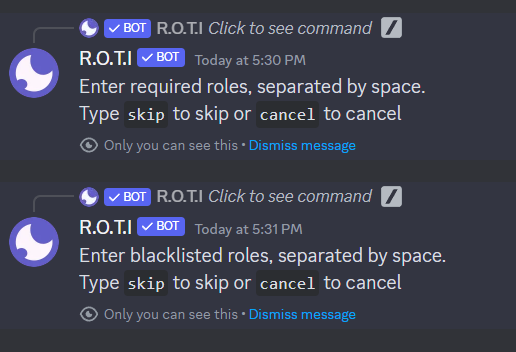

##### Step 5 - Repeat and Finish

Repeat **steps 2-3** to add as many role-emoji pairings to the message as you'd like.

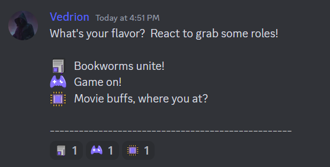
</Steps>

### Managing Reaction Roles

As your server evolves, you might need to adjust your reaction role setup. Perhaps roles change, or you want to simplify how users interact with them. Here's how to remove reaction roles with precision or in bulk:

#### Removing Reaction Role

Removes a previously configured reaction role assignment from a designated message.

```bash filename="Usage"
/reactionrole remove [message] [emoji] [channel]
```

Options:

- `[message_id]`: The ID of the message linked to the reaction role.
- `[emoji]`: The specific emoji that triggers the role assignment/removal.
- `[channel]`: The text channel where the message is located.

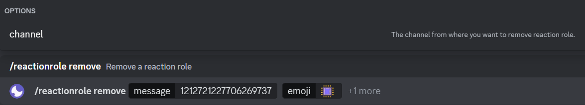

#### Advanced Removal

This command provides flexibility in removing multiple reaction roles at different levels.

- `Target a Message`: Clear all reaction roles associated with a particular message.
- `Clean Sweep a Channel`: Remove every reaction role from all messages within specified channel.
- `Server-Wide Reset`: Remove all reaction roles across your entire Discord server.

Reaction role removal is permanent. Consider carefully before using `/reactionrole removeall` options, especially at the **channel** or **server** level.

```bash filename="Usage"
/reactionrole removeall [channel] [message]
```
Options:

- `[channel]`: Removes all reaction roles from every message within a specified channel.
- `[message]`: Removes all reaction roles associated with a specific message within a channel.

<Callout type="error" emoji="💀">
If no options are specified (`channel` or `message`), it will lead to the removal of all reaction roles across the entire Discord server.
</Callout>

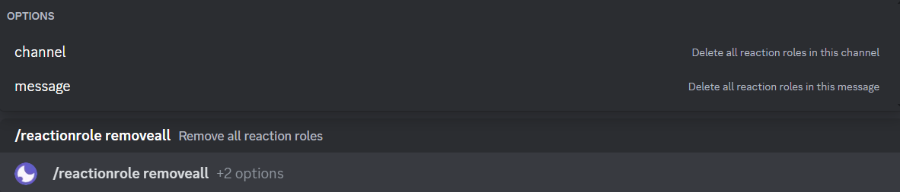

## <span className="txp">Conclusion</span>

By strategically implementing self-assignable roles, you can create a more organized, engaging, and efficient server environment. These features reduce the workload of manual role assignment, promote member participation in shaping their own experience, and help categorize users based on their preferences or status within the community.