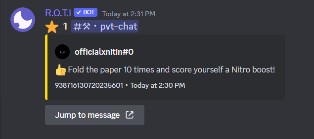
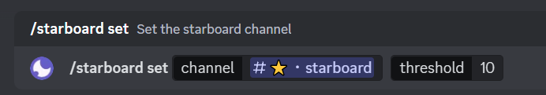
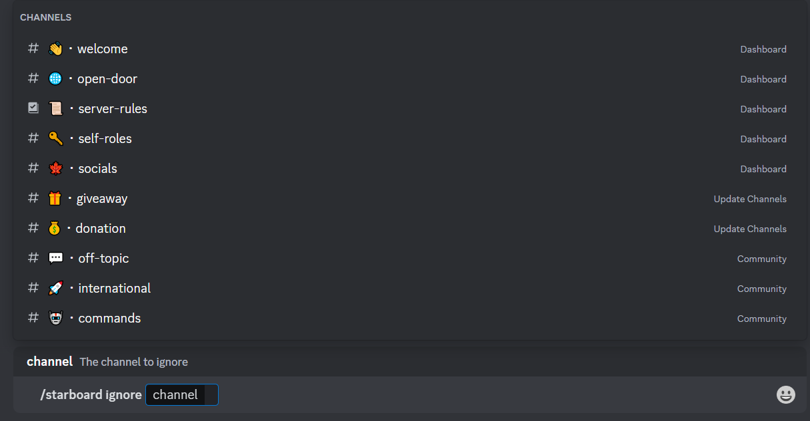

import { Steps } from 'nextra/components'

# Starboard

The Starboard System allows you to highlight and showcase standout messages that receive a certain number of star reactions. Let's explore the features and commands of the Starboard System in detail:

## Commands

The Starboard category offers a range of commands, including:

| Command            | Description                                                         |
| ------------------ | ------------------------------------------------------------------- |
| /starboard set     | Sets the channel where starred messages will be posted              |
| /starboard enable  | Enable Starboard channel                                            |
| /starboard disable | Disable Starboard channel                                           |
| /starboard ignore  | Add/Remove a specific channel from being monitored by the starboard |

## Introduction to Starboard

The Starboard System is designed to promote and appreciate exceptional messages in your server. It enables your members to react with a star emoji (⭐) to express their admiration or recognition for a particular message. Once a message reaches a specified threshold of star reactions, it is displayed on the starboard, a dedicated channel that serves as a showcase for remarkable content.



## Set up Starboard System

The `/starboard set` command is used to configure the starboard channel and set the star threshold. This command requires the following arguments:

- **channel**: Specify the channel where the starboard messages will be displayed. This should be a dedicated channel exclusively for the starboard.

- **threshold**: Set the number of star reactions required for a message to appear on the starboard. This threshold determines the level of recognition for a message.



**Command Usage:**

```bash
/starboard set [channel] [threshold]
```

## Enable Starboard System

The `/starboard enable` command enables the Starboard System in your server. Once enabled, members will be able to start starring messages for recognition on the starboard.

**Command Usage:**

```bash
/starboard enable
```

## Disable Starboard System

The `/starboard disable` command disables the Starboard System in your server. When disabled, members will no longer be able to star messages, and the starboard functionality will be turned off.

**Command Usage:**

```bash
/starboard disable
```

## Ignoring Specific Channels

The `/starboard ignore` command allows you to specify the channel that should be ignored by the Starboard System. Messages in this channel will not be eligible for the starboard.



**Command Usage:**

```bash
/starboard ignore [channel]
```

## Manual Message Submission

To send a message to the starboard without the need for a minimum number of stars or thresholds, follow these steps:

<Steps>
### Right-click on the Message

Locate the message that you wish to send to the starboard within the Discord chat.

### Select - Apps

After right-clicking on the message, a context menu will appear. From this menu, hover your cursor over the `Apps` option.

### Click - Send to Starboard

Once you've hovered over `Apps`, a sub-menu should appear. In this sub-menu, click on the `Send to Starboard` option.
</Steps>


By following these steps, you can instantly send a message to the starboard without any minimum star requirements or thresholds. This feature allows you to promote content to the starboard without any additional conditions.

## <span className="txp">Conclusion</span>

Now that you have a detailed understanding of each command in the Starboard System, you can effectively configure and manage the starboard functionality in your server. Remember to select a dedicated channel, set an appropriate star threshold, and utilize the ignore command to tailor the starboard system to your specific needs.