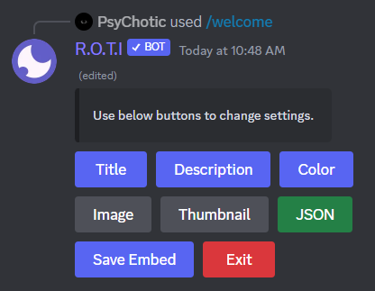
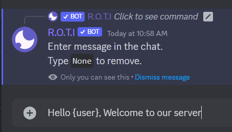

import { Callout } from 'nextra/components'
import { Steps } from 'nextra/components'

# Welcome

Are you tired of manually welcoming new members to your server with the same boring message every time? Well, fear not! R.O.T.I's `/welcome` command is here to help you out. The welcome feature allows you to greet new members and make them feel welcomed to your server. Customize your welcome message, add images or gifs to make it more personalized. This feature makes it easy to establish a warm and friendly environment for new members joining your community.

## Commands

| Command  | Description                              |
| -------- | ---------------------------------------- |
| /welcome | Set up a welcome message for new members |

## Configuration

Let's dive into the steps of setting up your own custom welcome message, but first, let me remind you of one of my favorite jokes:

<Callout type="info" emoji="👻">
  Why don't scientists trust atoms? Because they make up everything!
</Callout>

Now, let's get back to business!

<Steps>
### Open the Welcome Panel

To get started with setting up your custom welcome message, simply type `/welcome` in any text channel on your Discord server. This will open up the welcome configuration panel where you can set up your welcome message. It's like the first shot of a blockbuster movie, setting the stage for what's to come.

### Set Up a Custom Embed

In the welcome configuration panel, click on the `Change embed` button to set up a custom embed for your welcome message. Here, you can add an image, change the background color, and more. Customizing your embed is a great way to make your welcome message stand out and reflect the personality of your Discord server. It's like adding special effects to your movie, making it stand out from the rest.

Refer to the detailed embed creation guide [here](/basic-configuration/embeds).

### Set Up an Auto Join Role

By clicking on the `Change role` button in the welcome configuration panel, you can set up an auto join role for new members. This means that when someone joins your Discord server, they will automatically be given the specified role. This is a great way to welcome new members and get them engaged with your server. It's like casting the perfect actors for your movie, ensuring they fit the part.

### Set Up the Welcome Channel

When setting up your custom welcome message, you'll want to choose the channel where new members will see your message. By clicking on the `Change channel` button in the welcome configuration panel, you can choose the channel where the welcome message will be sent. This is usually a general chat or welcome channel. It's like choosing the perfect location to film your movie, making sure the setting is just right.

### Add a Custom Message

One of the most important aspects of your custom welcome message is the message itself. By clicking on the `Change message` button in the welcome configuration panel, you can add your own custom message to the welcome message. You can use TagScript variables to create dynamic messages that include user-specific information like their username and join date. You can also add custom emojis and formatting to your message. It's like writing the perfect script for your movie, making sure it's entertaining and engaging.

### Test the Welcome Message

Before publishing your custom welcome message, it's always a good idea to preview it to make sure it looks the way you want it to. By clicking on the `Test` button in the welcome configuration panel, you can preview your welcome message in the channel you selected. This is a great way to make sure everything looks and works as expected. It's like watching the final cut of your movie before it hits the theaters.

</Steps>

### Toggle Autodecancer

Zalgo characters are often used to create unique and interesting usernames, but they can also be difficult to read and may not fit with the overall tone of your Discord server. By clicking on the `Toggle autodecancer` button in the welcome configuration panel, you can automatically remove zalgo characters from a user's name whenever a new user joins your server. It's like removing the unnecessary elements from your movie, making sure it's polished and professional.

### Removing Embed (Optional)

If you decide that you no longer want to use an embed in your welcome message, simply click on the `Remove embed` button in the welcome configuration panel. This will remove the embed from your welcome message. It's like cutting out a scene from your movie that doesn't quite fit in.

<Callout type="warning" emoji="⚠️">
  This will remove existing embed and previous embed can't be recoverd once removed.
</Callout>

### Exit the Welcome Panel

Click on the `Exit` button to exit the welcome configuration panel. If you click exit, all buttons will be unusable, and you will need to run the `/welcome` command again to set up your welcome message. It's like wrapping up your movie, saying "that's a wrap!"

## Welcome variables

Welcome Variables are a collection of parameters that can be utilized to customize your server's welcome message. These variables represent information about the user and server and are replaced with actual values when a new user joins the server. Using these variables helps to make the welcome message personalized and informative. Each variable is enclosed in curly braces and will be substituted with the corresponding value when the message is sent.

| Variables              | Description                                                                               |
| ---------------------- | ----------------------------------------------------------------------------------------- |
| `{user}`                 | Mentions the new user who joined                                                          |
| `{username}`             | Mentions the username of the new user who joined                                          |
| `{memberCount}`          | Mentions the total member count in the server                                             |
| `{Membercount.ordinal}`  | Mentions the ordinal representation of the new user's join position (e.g., 1st, 2nd, 3rd) |
| `{server.name}`          | Mentions the name of the server where the new user joined                                 |
| `{server(icon)}`         | Display the server's icon                                                                 |
| `{member.displayAvatar}` | Display avatar of the new user who joined                                                 |

## Conclusion

And that's a wrap! You now have a custom welcome message set up in your Discord server, ready to greet new members with a warm hello. So, grab some popcorn, sit back, and enjoy the show!