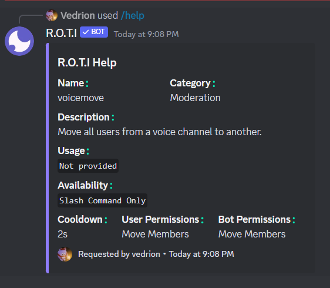

import { Steps } from 'nextra/components'

# Core

These commands are the heart of R.O.T.I, helping you and your server get started! Whether you need a help guide, want to invite R.O.T.I to another server, or just want to check how fast it's running, these core commands have you covered.

## Commands

The Core category offers a range of commands, including:

| Command | Description                                     | Usage                   |
| ------- | ----------------------------------------------- | ----------------------- |
| /help   | Displays a list of available commands           | `/help [command]`       |
| /invite | Invite our bot to your server                   | `/invite`               |
| /ping   | Shows the current latency of bot                | `/ping`                 |
| /report | Report bugs or glitches to our development team | `/report [attachments]` |

## Help Command

The `/help` command is your key to unlocking the full potential of R.O.T.I. It serves as both a quick reference guide and a detailed manual. Use `/help` on its own to get a list of all the command categories R.O.T.I has to offer.

### Usage

```bash
/help
```

If you need more specifics,  try `/help [command]` to get step-by-step instructions on a particular command, including what it does, the exact format to use it, and any special permissions it might require.

### Example

```bash
/help voicemove
```

**Output**



## Invite Command

Want to share the awesomeness of R.O.T.I with your other Discord communities? The `/invite` command makes it easy! It  generates a special invitation link that lets you add R.O.T.I to any Discord server where you have the necessary permissions.

### Usage

```bash
/invite
```

## Ping Command

The `/ping` command reveals R.O.T.I's responsiveness and connection health. Think of it as a quick checkup! It reveals several important metrics:

<Steps>
### Websocket Heartbeat

Measures how consistently R.O.T.I communicates with Discord's servers.

### Roundtrip Latency

Shows how long it takes for messages to travel from you to Discord's servers and back to you. Lower latency means faster responses!

### DB Latency

Measures how quickly R.O.T.I interacts with its database.
</Steps>

Use `/ping` to ensure R.O.T.I is running smoothly and pinpoint any potential connection problems.

## Report Command

Your feedback is essential to making R.O.T.I the best bot it can be! The `/report` command provides a direct channel for communicating with the developers. If you encounter a bug, have a fantastic idea for a new feature, or just want to share your thoughts, we want to hear from you!

### Usage

```bash
/report [attachments]
```

### Make Your Report Count

The more detailed your report, the better we can help!  Here's how to make it clear and actionable:

- **Describe the Issue:** What went wrong? What were you trying to do?
- **Steps to Reproduce:** Can you reliably make the bug happen again? Explain how.
- **Include Visuals:** Screenshots or videos can be incredibly helpful!
- **Feature Ideas:** Explain your idea clearly and why it would be a great addition to R.O.T.I.

## <span className="txp">Conclusion</span>

Think of these Core Commands as your R.O.T.I starter kit!  You're now equipped with the essentials for navigating the bot, troubleshooting, and making your voice heard. These commands may seem simple, but they hold the power to shape your R.O.T.I experience. Let's keep building something great together! 🌟