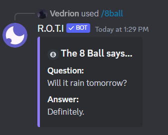
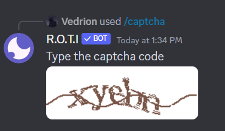
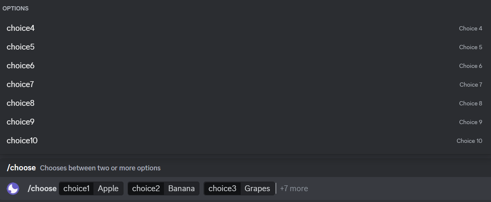
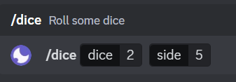
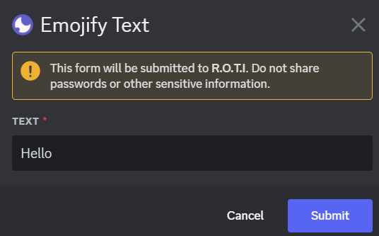
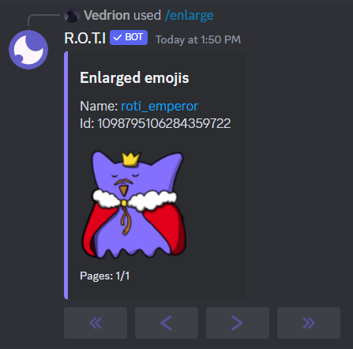
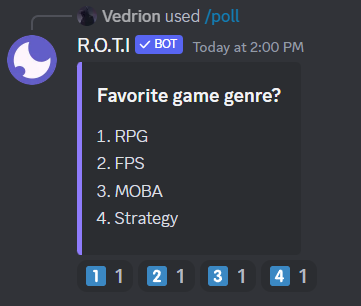
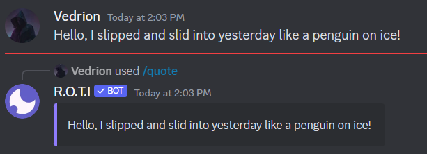
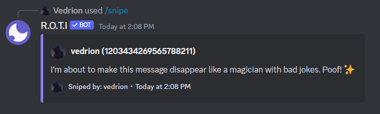
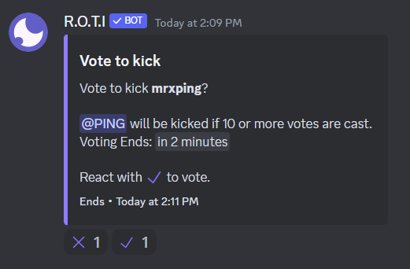

import { Callout } from 'nextra/components'

# Fun

These commands are dedicated to adding a layer of entertainment and interaction to your Discord server. Whether you're looking to break the ice, make decisions in a fun way, or just share a laugh with your community, our Fun Commands have got you covered.

From rolling dice and flipping coins to turning text into emojis and creating polls, there's something here for every type of fun. Let's discover how each command can bring more joy and engagement to your server.

## Commands

| Command   | Description                                              | Usage                        |
| :-------- | :------------------------------------------------------- | :--------------------------- |
| /8ball    | Get a random answer for your question                    | `/8ball [question]`          |
| /captcha  | Test your accuracy by solving captcha                    | `/captcha [level]`           |
| /choose   | Chooses between two or more options                      | `/choose [choices]`          |
| /dice     | Roll some dice                                           | `/dice [dice] [side]`        |
| /emojify  | Converts your text into emoji(s)                         | `/emojify`                   |
| /enlarge  | Enlarges an emoji                                        | `/enlarge [emojis]`          |
| /flip     | Flips a coin                                             | `/flip`                      |
| /password | Generates a strong random password                       | `/password [length]`         |
| /poll     | Creates a poll                                           | `/poll [title] [choices]`    |
| /quote    | Quotes previous message                                  | `/quote [message_id]`        |
| /snipe    | Shows the most recently deleted message (10 seconds max) | `/snipe`                     |
| /vkick    | Starts a voting to kick a user from the server           | `/vkick [user] [vote_count]` |

## 8 Ball

Get a mystical answer to any yes-or-no question you might have.

After asking a question, the 8-ball provides a random answer from a variety of responses, ranging from positive to negative and sometimes vague, adding an element of mystery and fun to decision-making or just for entertainment.

```bash filename="Usage"
/8ball [question]
```

Example:



## Captcha

Challenge yourself and others with a captcha test, adding a unique and interactive activity to your server.

This command generates a captcha for users to solve, available in different difficulty levels. It's a great way to engage users in a quick and fun activity, testing their speed and accuracy in a light-hearted competition.

```bash filename="Usage"
/captcha [level]
```

Example:



## Choose

Eliminate indecision by letting R.O.T.I randomly choose between given options.

Ideal for making group decisions or picking between multiple options. Input two or more choices, and the bot will select one for you. It's like flipping a coin but with more possibilities.

```bash filename="Usage"
/choose [option1] "option 2" "option 3"...
```

Example:



## Dice

Roll virtual dice with customizable sides and quantity, perfect for games or making random decisions.

This command simulates rolling dice, allowing you to specify the number and sides of dice. It's versatile for gaming, decision-making, or just for fun.

```bash filename="Usage"
/dice [number of dice] [sides per dice]
```

Example:



## Emojify

Transform any text into a string of emojis, adding a creative and fun twist to messages.

Each letter of the input text is converted into its corresponding emoji, making messages playful and visually appealing. It's a novel way to express thoughts or send messages within your community.

```bash filename="Usage"
/emojify
```

Example:



Output:


## Enlarge

Magnify an emoji to better view its details or share it as a larger image in conversations.

Useful for showcasing specific emojis in greater detail or simply for the fun of seeing them in a larger form. This command helps in highlighting emojis for reactions, explanations, or just for laughs.

```bash filename="Usage"
/enlarge [emoji]
```

Example:



## Flip

Leave things up to fate by flipping a virtual coin, ideal for decision-making or selecting between two options.

With a simple command, simulate a coin toss to make decisions or settle disputes. It's a straightforward, fair, and fun way to choose between two outcomes.

```bash filename="Usage"
/flip
```

Example:


## Password

Generate a secure, random password for personal use or to demonstrate strong password practices.

This command provides a randomly generated password of specified length, emphasizing the importance of secure and unique passwords.

<Callout emoji="🔒">
Only you can see the password, and it is not saved in our database either.
</Callout>

```bash filename="Usage"
/password [length]
```

Example:


## Poll

Create interactive polls to engage your server members in decisions, opinions, or just for fun queries.

This feature allows for the creation of custom polls with multiple options, facilitating community interaction and gathering opinions on various topics. It's useful for engaging and understanding your audience.

```bash filename="Usage"
/poll "Question" "Option 1" "Option 2" "Option 3"...
```

Example:



## Quote

Capture and quote a previous message, preserving memorable or important statements for easy reference.

Ideal for highlighting messages, sharing insights, or referencing discussions. This command requires the message ID, ensuring accuracy in quoting.

```bash filename="Usage"
/quote [message_id]
```

Example:



## Snipe

Reveal the last deleted message within a channel, adding an element of mystery and surprise to your server interactions.

This command fetches the most recently deleted message within the last `10 seconds`, allowing users a brief glimpse into what was said before it vanished. It's a playful way to keep conversations transparent and engaging, specifically capturing messages deleted within a short timeframe.

```bash filename="Usage"
/snipe
```

Example:



## VKick

Initiate a community vote to kick a user from the server, democratizing moderation actions.

This command sets up a vote requiring a specified number of votes to kick a user, blending moderation with community input. It's a responsible way to involve members in maintaining server etiquette.

```bash filename="Usage"
/vkick [user] [vote_count]
```

Example:



## <span className="txp">Conclusion</span>

Explore the world of R.O.T.I.'s Fun Commands to add laughter, engagement, and excitement to your Discord server. Whether you're making decisions, rolling dice, or creating polls, these commands are your key to a lively and connected community. Start exploring now and watch the positive vibes unfold in your server! 😄🎉