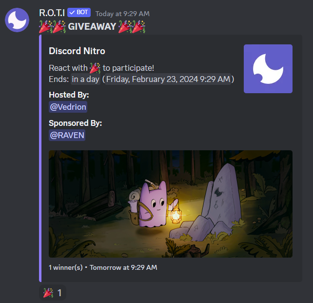
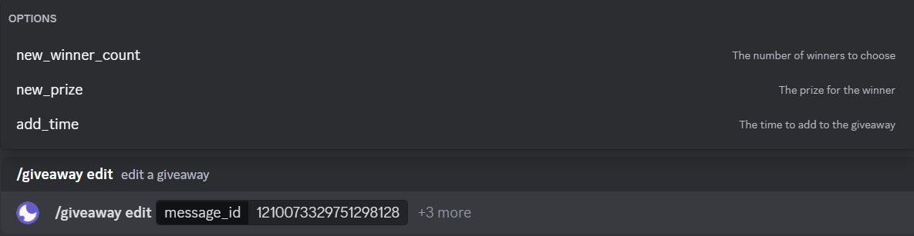
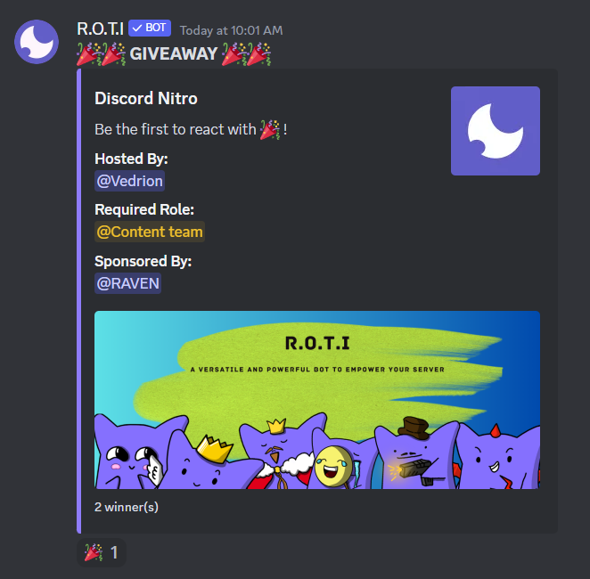
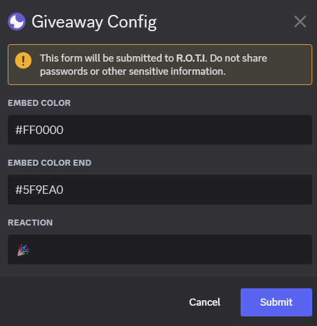

import { Steps } from 'nextra/components'
import { Callout } from 'nextra/components'

# Giveaway

R.O.T.I's Giveaway commands empower you to create and manage dynamic giveaways, enriching your Discord community experience. Whether you prefer quick reaction-based giveaways or fully-customized contests, these commands streamline the setup, winner selection, and everything in between.

## Commands

|     Command      |                         Description                          |                       Usage                       |
| :--------------: | :----------------------------------------------------------: | :-----------------------------------------------: |
| /giveaway config |        Configure the giveaway settings for the server        |                `/giveaway config`                 |
| /giveaway delete |                  Delete a specific giveaway                  |          `/giveaway delete [message_id]`          |
|  /giveaway drop  | Start a giveaway that picks a winner from the first reaction | `/giveaway drop [winner_count] [prize] [options]` |
|  /giveaway edit  |                   Edit a specific giveaway                   |      `/giveaway edit [message_id] [options]`      |
|  /giveaway end   |                End a specific giveaway early                 |           `/giveaway end [message_id]`            |
|  /giveaway list  |               List all giveaways in the server               |             `/giveaway list [filter]`             |
| /giveaway pause  |                  Pause a specific giveaway                   |   `/giveaway pause [message_id] [resume_after]`   |
| /giveaway reroll |                      Reroll a giveaway                       |  `/giveaway reroll [message_id] [winner_count]`   |
| /giveaway resume |                  Resume a specific giveaway                  |          `/giveaway resume [message_id]`          |
| /giveaway start  |                Start a giveaway in the server                |            `/giveaway start [options]`            |

## Hosting a Giveaway

Launch a giveaway in your Discord server with ease using R.O.T.I's `/giveaway start` command. Just set the duration, number of winners, prize etc. and let the bot take care of the rest. Whether it's a quick one-day event or a more extended contest, customize it to fit your community's taste. This command simplifies the giveaway setup, making it a straightforward and enjoyable experience for everyone involved.

```bash filename="Usage"
/giveaway start [options]
```

### Parameters

**Required:**

- `duration`: The length of the giveaway.
- `winner count`: The number of winners to be selected at the end of the giveaway.
- `prize`: The amazing reward(s) offered to the winner(s).

**Optional:**

- `channel`: The specific text channel to host the giveaway. Defaults to the current channel if not provided.
- `required role`: Require users to possess a specific role to enter the giveaway.
- `required invites`: Require users to have a certain number of server invites to enter.
- `sponsor`: The name or entity sponsoring the giveaway.
- `image`: An image to be included in the giveaway embed.
- `thumbnail`: A smaller thumbnail image for the giveaway embed.
- `ping`: A role to be mentioned when the giveaway is announced.
- `message`: Additional text to include in the giveaway embed.



## Editing a Giveaway

Modify the details of an ongoing giveaway effortlessly with R.O.T.I's `/giveaway edit` command. Simply provide the message ID, and then adjust the winner count, update the prize, or extend the duration by adding more time. This command gives you the flexibility to refine and adapt your giveaway as needed, ensuring a seamless and personalized experience for both you and your community. Whether you're fine-tuning the specifics or making last-minute adjustments, this command makes the process simple and efficient.

```bash filename="Usage"
/giveaway edit
```
**How It Works:**

<Steps>
### Find the Message ID

Locate the original giveaway announcement message. Usually you can right-click on the message and select "Copy ID".

<Callout>
The **message_id** refers to the unique identifier Discord assigns to each message. See [How to get a message ID on Discord](https://support.discord.com/hc/en-us/articles/206346498-Where-can-I-find-my-User-Server-Message-ID).
</Callout>

### Use the Command

Type `/giveaway edit [Message ID]` and replace [Message ID] with the actual ID you copied.

### Make Changes

You'll likely be prompted with options. Here's what you can edit:

- Winners: Increase or decrease the number of winners.

- Prize: Update the description of what people win.

- Duration: Add more time to the giveaway if it's still running.
</Steps>



## Quick Giveaway

The `/giveaway drop` command sets up a giveaway where the winner(s) are chosen from the first participants to react to the giveaway message. Perfect for quick and exciting events, it encourages instant engagement from your community. Just specify the number of winners and the prize, and R.O.T.I will handle the rest.

```bash filename="Usage"
/giveaway drop [options]
```

### Parameters

**Required:**

- `winner count`: The number of winners to be selected at the end of the giveaway.
- `prize`: The amazing reward(s) offered to the winner(s).

**Optional:**

- `channel`: The specific text channel to host the giveaway. Defaults to the current channel if not provided.
- `required role`: Require users to possess a specific role to enter the giveaway.
- `required invites`: Require users to have a certain number of server invites to enter.
- `sponsor`: The name or entity sponsoring the giveaway.
- `image`: An image to be included in the giveaway embed.
- `thumbnail`: A smaller thumbnail image for the giveaway embed.
- `ping`: A role to be mentioned when the giveaway is announced.
- `message`: Additional text to include in the giveaway embed.



## Customization

The `/giveaway config` command allows you to personalize the appearance and functionality of giveaways within your Discord server.

```bash filename="Usage"
/giveaway config
```
<Callout type="info">
After configuration, the settings will apply to future giveaways.
</Callout>

### Options

**Custom Embed Color**

- Use this option to set a default color for all giveaway embeds. This creates a consistent visual theme for your giveaways.
- Provide a hex color code (e.g., #FF00FF).

**Custom Embed Color After Giveaway End**

- Set a default color for giveaway embeds after they conclude. This visually distinguishes ended giveaways.
- Provide a hex color code for this setting.

**Custom Emoji**

- Define a custom emoji (standard or server-specific) to be used for giveaway reactions. This adds a unique touch to your giveaways.



## Management

Fine-tune ongoing giveaways, quickly resolve unexpected hiccups, and ensure your giveaways always run smoothly. Maintain complete control over the giveaway experience from start to finish.

### Delete Giveaway

Permanently removes a specified giveaway from your server.

```bash filename="Usage"
/giveaway delete [message_id]
```
`message_id`: The ID of the giveaway message you want to delete.

### End Giveaway

Ends an active giveaway prematurely, immediately selecting winner(s).

```bash filename="Usage"
/giveaway end [message_id]
```

### List Giveaways

Displays a list of giveaways on your server, with options to filter by status.

```bash filename="Usage"
/giveaway list [filter]
```

**Filter:**

- `All`: Shows both active and ended giveaways.
- `Active`: Shows only the giveaways that are currently running.
- `Ended`: Shows only the giveaways that have concluded.

### Pause Giveaway

Temporarily pauses an active giveaway.

```bash filename="Usage"
/giveaway pause [message_id] [resume_after]
```

Options:

- `message_id`: The ID of the giveaway you want to pause.
- `resume_after`: (Optional) Time duration until the giveaway automatically resumes.

### Resume Giveaway

Resumes a paused giveaway, allowing it to continue.

```bash filename="Usage"
/giveaway resume [message_id]
```

### Reroll Giveaway

Selects new winner(s) for an ended giveaway.

```bash filename="Usage"
/giveaway reroll [message_id]
```

## <span className="txp">Conclusion</span>

Transform your Discord server with exciting giveaways! These commands provide all the tools you need to create dynamic contests, deliver awesome rewards, and boost community participation.

Remember These Key Commands:

- `/giveaway start` Initiate a new giveaway.
- `/giveaway config` Customize the look of your giveaways.
- `/giveaway list` View active and ended giveaways.

Need more help? Check out the R.O.T.I FAQ or visit our "Getting Started" guide.

Let the giveaways begin! 🎉