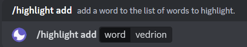
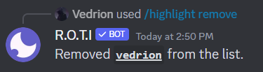
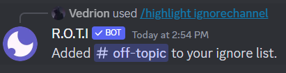
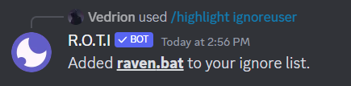
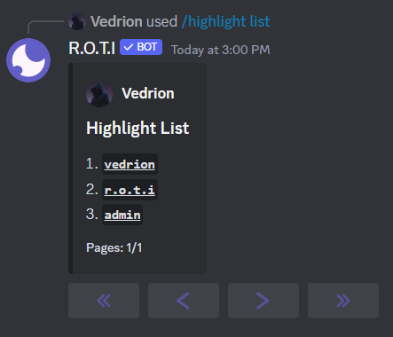
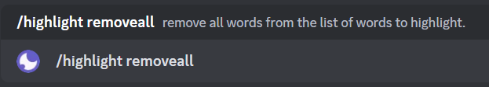

import { Callout } from 'nextra/components'

# Highlight

The Highlight category in R.O.T.I. provides powerful commands to help you stay informed about specific words or phrases in your Discord server. Whether you're interested in staying updated on particular topics, keeping tabs on specific users, or customizing your highlights to match your preferences, these commands offer precise control over your Discord experience.

<Callout emoji="📌">
You must enable your DMs so that R.O.T.I can message you.
</Callout>

## Commands

|         Command          |                        Description                         | Usage                                |
| :----------------------: | :--------------------------------------------------------: | :----------------------------------- |
|      /highlight add      | Add a word to the highlight list to be alerted for matches | `/highlight add [words]`             |
| /highlight ignorechannel |          Ignore a specific channel for highlights          | `/highlight ignorechannel [channel]` |
|  /highlight ignoreuser   |           Ignore a specific user for highlights            | `/highlight ignoreuser [user]`       |
|     /highlight list      |            List all words in the highlight list            | `/highlight list`                    |
|    /highlight remove     |           Remove a word from the highlight list            | `/highlight remove [words]`          |
|   /highlight removeall   |          Remove all words from the highlight list          | `/highlight removeall`               |

## Add to Highlight

Add a word to the highlight list to be alerted whenever it appears in the server.

This command allows you to specify one or more words that, when mentioned anywhere in the server, will trigger an alert for you. Stay in the loop on important topics or discussions.

<Callout type="info">
Highlights will only trigger when you've been inactive in that channel for more than 5 minutes.
</Callout>

```bash filename="Usage"
/highlight add [word]
```

Example:



## Remove a Highlight

Remove a word from the highlight list.

If you no longer want to receive alerts for a specific word, use this command to remove it from your highlight list. Customize your notification preferences effortlessly.

```bash filename="Usage"
/highlight remove [word]
```

Example:



## Ignore Specific Channel

Ignore a specific channel for highlight alerts.

If you don't want to receive highlights from a particular channel, use this command to exclude it from your alerts. Keep your notifications focused on the channels that matter most to you.

```bash filename="Usage"
/highlight ignorechannel [channel]
```

Example:



## Ignore Specific User

Ignore a specific user for highlight alerts.

Exclude specific users from triggering highlight alerts. Useful when you want to filter notifications and stay focused on relevant content.

```bash filename="Usage"
/highlight ignoreuser [user]
```

Example:



## List Highlighted Words

List all words currently in the highlight list.

Retrieve a comprehensive list of all the words currently in your highlight list. Keep track of your highlighted terms for quick reference.

```bash filename="Usage"
/highlight list
```

Example:



## Remove all Highlights

Remove all words from the highlight list.

Clear your entire highlight list at once. Useful when you want to start fresh or redefine your notification criteria.

```bash filename="Usage"
/highlight removeall
```

Example:



## <span className="txp">Conclusion</span>

In conclusion, the Highlight command empower you to customize your Discord experience. By highlighting custom words, ignoring channels or users, and managing your list, you have full control over what grabs your attention. Tailor your alerts, stay informed about specific topics, and enjoy a Discord experience that revolves around your preferences.