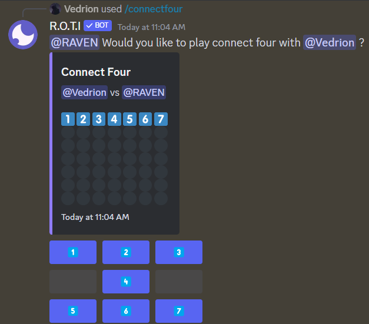
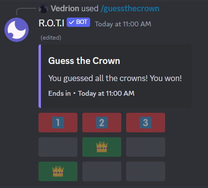
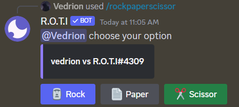
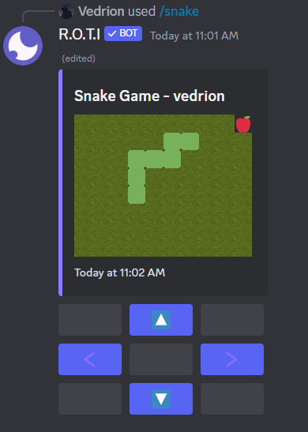
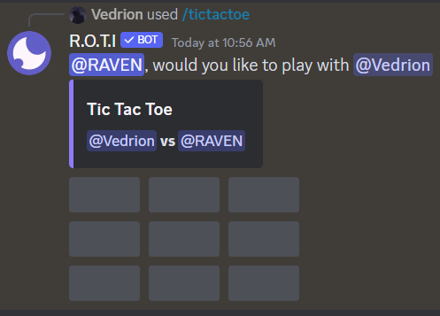

import { Callout } from 'nextra/components'

# Mini Games

Take a break and add some fun to your Discord server with these quick and engaging mini-games!  Test your luck, challenge your friends, or simply unwind with a bit of playful competition.

## Commands

|      Command      |                    Description                     | Usage                      |
| :---------------: | :------------------------------------------------: | :------------------------- |
|    /blackjack     |              Play a game of Blackjack              | `/blackjack`               |
|   /connectfour    | Play Connect Four game | `/connectfour [user]`      |
|   /guessthecrown    | Play Guess The Crown game | `/guessthecrown`      |
| /rockpaperscissor |            Play Rock Paper Scissor game            | `/rockpaperscissor [user]` |
|      /snake       |                Play a game of snake                | `/snake`                   |
|    /tictactoe     |               Play Tic Tac Toe game                | `/tictactoe [user]`        |

<Callout type="info">
You cannot play against the bot in most of these mini-games. However, you can face off against the bot in Rock Paper Scissors!
</Callout>

## Blackjack

- Test your card skills in a classic game of Blackjack against the dealer.
- Aim to get a hand total closer to 21 than the dealer without exceeding it **(going bust)**.

```bash filename="Usage"
/blackjack
```

Example:


## Connect Four

- Engage in a strategic battle against a friend in Connect Four.
- Take turns dropping your colored pieces into the vertical grid.
- The first player to line up four of their pieces horizontally, vertically, or diagonally wins!

```bash filename="Usage"
/connectfour [user]
```

Example:



## Guess The Crown

- A simple game of chance and prediction.
- Click the buttons to reveal the crowns one by one.
- You have 30 seconds and 5 attempts to correctly predict where the crown will land. Guess wisely to win!

```bash filename="Usage"
/guessthecrown
```

Example:



## Rock Paper Scissor

- Play a classic duel of Rock, Paper, Scissors against a friend.
- Choose your move (rock, paper, or scissors) simultaneously with your opponent.
- Remember the hierarchy: Rock beats Scissors, Scissors beats Paper, Paper beats Rock.

```bash filename="Usage"
/rockpaperscissor [user]
```

Example:



## Snake

- Experience the nostalgia of the classic Snake game!
- Control a snake as it moves around the screen, eating apples to grow longer.
- Avoid running into yourself, or it's game over!

```bash filename="Usage"
/snake
```

Example:



## Tic Tac Toe

- Challenge a friend to a timeless battle of wits in Tic Tac Toe.
- Take turns placing your symbol (X or O) on the 3x3 grid.
- Aim to get three of your symbols in a row, column, or diagonal to claim victory!

```bash filename="Usage"
/tictactoe [user]
```

Example:



## <span className="txp">Conclusion</span>

From classic card games to nostalgic favorites, this collection offers a mix of mini-game experiences.  Unwind, have fun, and add a playful spark to your server!