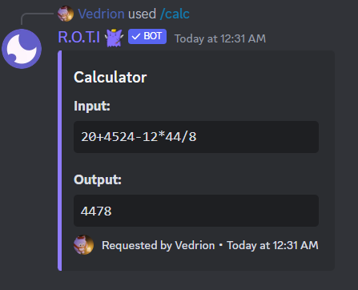
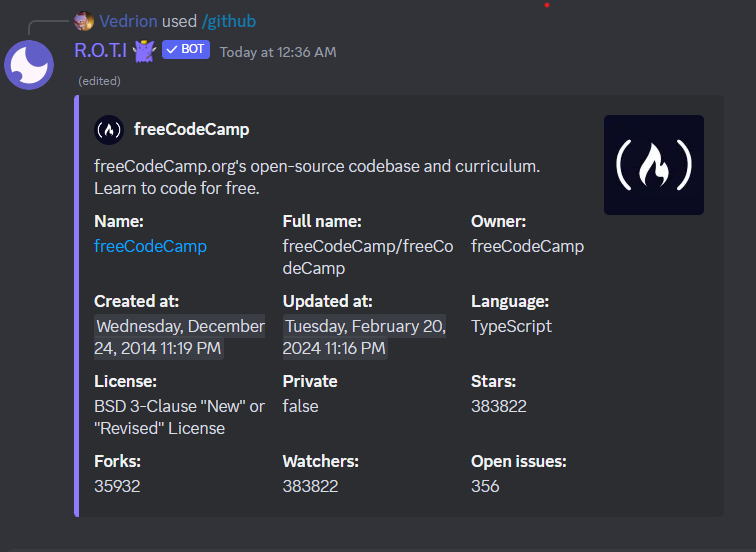
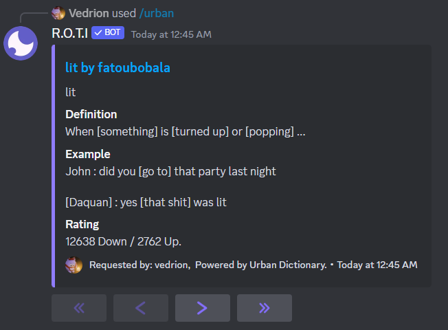

import { Steps } from 'nextra/components'
import { Callout } from 'nextra/components'

# Miscellaneous

Explore Discord and beyond with this diverse collection of commands. Gather user and server information, solve quick math problems, search for GitHub projects, and uncover a few fun surprises along the way.

## Commands

|    Command     |            Description             | Usage                   |
| :------------: | :--------------------------------: | :---------------------- |
| /avatar server |      Get user's server avatar      | `/avatar server [user]` |
|  /avatar user  |         Get user's avatar          | `/avatar user [user]`   |
|    /banner     |         Shows user banner          | `/banner [user]`        |
|     /calc      |     Calculate math expressions     | `/calc [expression]`    |
|    /github     |   Search for a GitHub repository   | `/github [repository]`  |
|    /lookup     |    Get information about a user    | `/lookup [user]`        |
|  /membercount  | Shows total member count of server | `/membercount`          |
| /serverbanner  |        Shows server banner         | `/serverbanner`         |
|  /servericon   |         Shows server icon          | `/servericon`           |
|  /serverinfo   |      Shows server information      | `/serverinfo`           |
|     /urban     |           Defines a word           | `/urban [query]`        |
|   /userinfo    |       Shows user information       | `/userinfo [user]`      |

## Avatar Commands

These commands serves as the foundation for retrieving both server-specific and global Discord avatars. `/avatar` command requires one of the following subcommands:

<Steps>
### Server Avatar

`/avatar server` command displays a user's server avatar **(profile picture)** within the current Discord server. Server avatars can differ from a user's global avatar if customized specifically for a particular server.

```bash filename="Usage"
/avatar server [user]
```

### Global Avatar

`/avatar user` fetches a user's global Discord avatar, the profile picture they use consistently across all Discord servers.

```bash filename="Usage"
/avatar user [user]
```
</Steps>

<Callout type="info">
If you don't specify a user, it will show your own avatar.
</Callout>

## User Commands

<Steps>
### User Banner

Displays a user's profile banner if they have one. Banners are large profile pictures and require a Discord Nitro subscription. Note that not all users will have banners set.

Example:

```bash
/banner vedrion
```
Output:


### User Information

This command provides the most comprehensive Discord profile overview for a specified user. It includes:

- `Username`: Their Discord username (e.g., vedrion)
- `Roles`: Server-specific roles assigned to highlight the user's permissions or contributions.
- `Account Creation Date`: When their Discord account was first created.
- `Server Join Date`: When they joined the current Discord server.
- `Boosting Status`: Indicates if the user has boosted the server.
- `Key Permissions`: Lists the user's permissions within the server.
- `Acknowledgement`: Indicates special privileges the user might have (e.g., Server Admin).
- `Badges`: Discord offers special badges for Nitro subscribers, HypeSquad members, and more.
- `User ID`: Their unique Discord identifier (useful for developers).
- `Avatar`: Displays a small thumbnail of the user's avatar.

```bash filename="Usage"
/userinfo [user]
```
</Steps>

## Server Commands

<Steps>

### Server Banner

This command displays the current server's banner image if one is set. Server banners are customizable by server owners or Admins.

```bash filename="Usage"
/serverbanner
```
### Server Icon

This command retrieves and displays the current server's icon (also known as its profile picture).

```bash filename="Usage"
/servericon
```
### Server Information

This command provides a comprehensive overview of the current Discord server, including:

- Server Name
- Server Owner
- Verification Level
- Boost Status
- Category Channels
- Text Channels Count
- Voice Channels Count
- Total Channels
- Stickers Count
- Emoji Count
- Total Roles
- Member Count
- Server ID
- Creation Date

```bash filename="Usage"
/serverinfo
```
</Steps>
## Lookup Command

`/lookup` command provides essential Discord profile information about a user. It includes:

- Username (e.g., vedrion)
- Unique Discord identifier (user ID)
- Account Creation Date
- Profile Photo

```bash filename="Usage"
/lookup [user]
```

<Callout type="info">
You can retrieve information for users not currently in your server by searching directly with their User ID.
</Callout>

## Calculator Command

Functions as a calculator that solves mathematical expressions directly within Discord.

```bash filename="Usage"
/calc [expression]
```

Example:



## GitHub Command

`/github` command searches for public repositories on GitHub and displays a brief summary.

```bash filename="Usage"
/github [repository]
```

Example:



## Server Members

`/membercount` command displays the current total number of members within your Discord server.

```bash filename="Usage"
/membercount
```

## Urban Command

Searches Urban Dictionary, a crowdsourced online dictionary of slang and colloquial terms, for the provided word or phrase.

```bash filename="Usage"
/urban [query]
```

Example:



## <span className="txp">Conclusion</span>

This collection of commands empowers you to gather essential Discord information, perform quick calculations, and explore projects on GitHub. Unlock a more efficient Discord experience with these versatile functionalities at your fingertips!