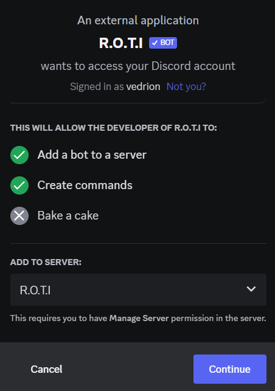

import { Steps } from 'nextra/components'
import { Callout } from 'nextra/components'

# Adding the Bot

Unsure of how to add R.O.T.I to your server? No problem! This guide will guide you through the process of inviting our bot to your Discord server.

<Steps>
### Step 1 - Preparation
 
Before you can invite the R.O.T.I discord bot to your server, you'll need to be the owner of the server or have the `Manage Server` permission enabled on your role.
 
### Step 2 - Inviting the Bot
 
To invite the bot to your server, use the following URL or just [click here](https://discord.com/api/oauth2/authorize?client_id=903690362114158632&scope=applications.commands+bot&permissions=1543892063&redirect_uri=https%3A%2F%2Fdiscord.gg%2Fw5b7dYRMZH&response_type=code)

```bash copy
https://discord.com/api/oauth2/authorize?client_id=903690362114158632&scope=applications.commands+bot&permissions=1543892063&redirect_uri=https%3A%2F%2Fdiscord.gg%2Fw5b7dYRMZH&response_type=code
```
### Step 3 - Selecting the Server

After accessing the URL, you'll be prompted to select the server you want to add the R.O.T.I bot to. Choose the server you want to add the bot to, and then click the `Authorize` button.



### Step 4 - Finalizing the Invitation

Once you've authorized the bot, it will be added to your Discord server. You can start using the R.O.T.I bot right away by typing the appropriate commands in the server.

### Step 5 - Managing Bot Permissions

If you need to adjust the bot's permissions, you can do so by navigating to the `Server Settings` section of your Discord server, selecting the `Roles` tab, and then selecting the bot's role. From there, you can adjust the bot's permissions as desired.
</Steps>

<Callout type="info" emoji="🤖">
 That's It! You are now fully equipped to begin utilizing the R.O.T.I bot on your Discord server.
</Callout>