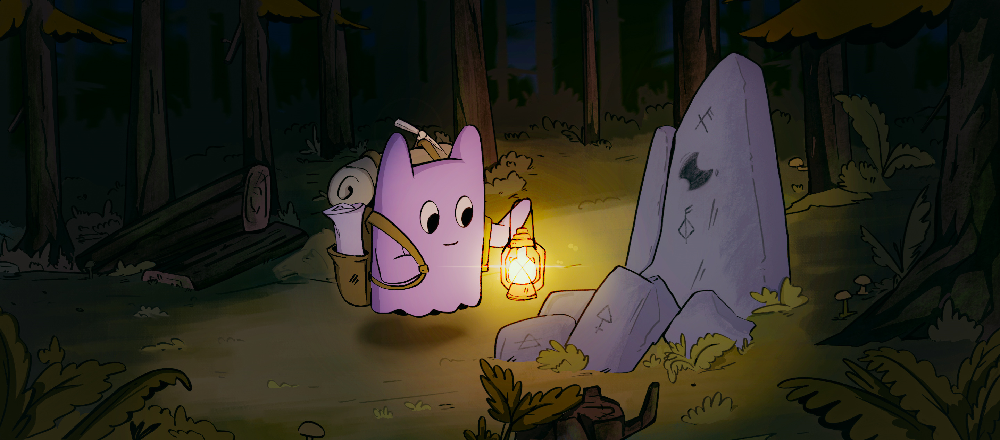

import { Cards, Card } from 'nextra/components'
import { ShieldCheck, TicketCheck,FileClock, Code, Moon, SquarePen, User } from 'lucide-react';

# Introduction
 
Lights, camera, action! Are you ready to take your Discord server to the next level? Introducing R.O.T.I, the ultimate Discord bot that simplifies server management and boosts user engagement. With R.O.T.I, you'll have all the tools you need to create a dynamic and engaging community.

## Key Features

R.O.T.I offers an array of features to make server management and user engagement more effective. The following are some of its key features:

<Cards>
  <Card icon={<ShieldCheck />} title="Moderation" href="/user-management/moderation" />
  <Card icon={<TicketCheck />} title="Ticket system" href="/server-management/ticket-system" />
  <Card icon={<FileClock />} title="Logging" href="/server-management/logs" />
  <Card icon={<Moon />} title="Embeds" href="/basic-configuration/embeds" />
  <Card icon={<Code />} title="Custom commands" href="/server-management/tags-triggers" />
  <Card icon={<SquarePen />} title="Suggestion system" href="/server-management/suggestion" />
  <Card icon={<User />} title="Role Management" href="/user-management/role-administration" />
</Cards>

## Conclusion

In conclusion, R.O.T.I stands as a comprehensive Discord bot that revolutionizes server management and enhances user engagement. With its impressive array of features, R.O.T.I provides everything you need to build and maintain a vibrant community.
