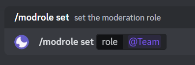
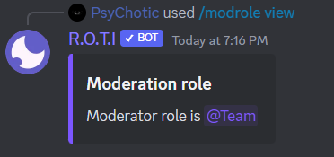
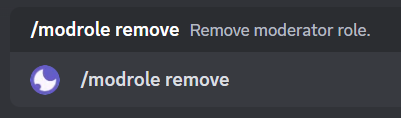

import { Callout } from 'nextra/components'

# Moderation role

The Mod Role command bestows upon you extraordinary moderation superpowers, ensuring a harmonious and well-managed server. By assigning the mod role, users gain access to R.O.T.I's powerful moderation commands, enabling them to shape your server into a well-regulated and welcoming community. Empower your trusted members with R.O.T.I's comprehensive moderation commands, guaranteeing a safe and engaging environment for all. Harness the power of the mod role and cultivate a server where everyone feels valued and secure.

## Commands

| Command         | Description                                      |
| --------------- | ------------------------------------------------ |
| /modrole set    | Set the role required to use moderation commands |
| /modrole view   | Displays the current moderation role             |
| /modrole remove | Removes the current moderation role              |

## Set up Mod role

Ready to empower the chosen ones? With the `/modrole set` command, you can anoint a role with the prestigious mod role. This grants the members assigned to this role access to R.O.T.I's advanced moderation commands. They become the guardians of the community, ensuring everyone's safety and enforcing the server's rules effectively.

<Callout type="error" emoji="️⚠️">
Choose individuals whom you trust to wield this authority responsibly and ensure the smooth functioning of your server.
</Callout>

## Inspecting Mod role

Use the `/modrole view` command to unveil the esteemed moderators holding the mod role. These individuals have access to R.O.T.I's arsenal of powerful moderation commands, allowing them to enforce rules, resolve conflicts, and maintain order. They are the guardians who ensure a safe and welcoming environment for all members.

## Removing Mod role

Sometimes, a change in the tides is necessary. The `/modrole remove` command allows you to revoke the mod role from specific individuals. When the mod role is removed, users lose access to R.O.T.I's moderation commands. This action can be helpful when reevaluating the moderation team or transitioning to a more community-driven approach to governance.

## Conclusion

By granting the mod role to trusted members in your server, you equip them with the power to maintain order and enforce rules using R.O.T.I's robust moderation commands. The mod role is your key to a harmonious and well-managed community, where conflicts are swiftly resolved, and a safe and engaging environment is maintained. Remember, the mod role is a responsibility that comes with great power. Choose individuals who are trustworthy, fair, and knowledgeable about your server's rules and guidelines. With the mod role in their hands, they can actively contribute to shaping a positive and inclusive community.