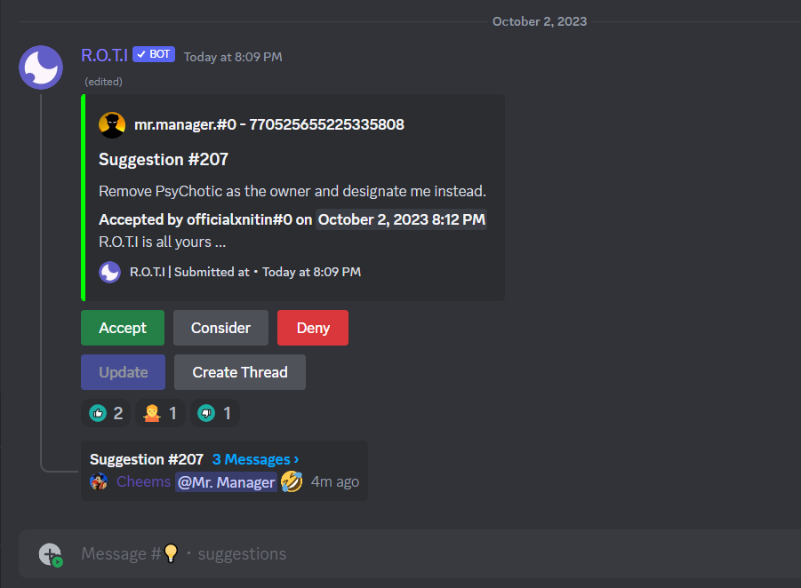

import { Steps } from 'nextra/components'
import { Callout } from 'nextra/components'

# Suggestion

The Suggestion category is a collection of commands that enable server members to make suggestions and give feedback, providing them with a voice in the community. These commands allow members to submit suggestions, which are then managed and responded to by moderators. With these tools, community members can offer ideas for improving the server, and moderators can efficiently track and respond to those suggestions.

## Commands

The Suggestion category offers a range of commands, including:

| Command             | Description                                              |
| ------------------- | -------------------------------------------------------- |
| /suggest            | Submit a suggestion for the server                       |
| /suggestion set     | Set the suggestion channel for server                    |
| /suggestion accept  | Accept a suggestion                                      |
| /suggestion decline | Decline a suggestion                                     |
| /suggestion config  | Configure the suggestion system settings                 |
| /suggester          | Display the user associated with a particular suggestion |

## How to suggest

The **suggest** command enables users to submit suggestions to the server. Users can either type the command `/suggest`, or they can use the optional arguments `[image]` and `[anonymous]`.

The `[image]` argument can be used to attach an image to the suggestion, while `[anonymous]` is used to submit anonymous suggestions. If a user chooses to submit an anonymous suggestion, other members of the server will not be able to see who made the suggestion, although the admins will still have access to this information.


## Suggestion channel

The `/suggestion set` command is used to set the suggestion channel where all suggestions will be sent. This command allows moderators to choose a specific channel where all user suggestions will be aggregated, making it easier for them to manage and respond to feedback. This command can be used multiple times to change the suggestion channel at any time.


## Managing Suggestions

The Suggestion category includes two commands for moderators to manage and respond to suggestions: `/suggestion accept` and `/suggestion decline`.

#### <span style={{ color: '#8570fe' }}>Suggestion accept</span>

This command is used by moderators to accept a suggestion. Once a suggestion is accepted, the color of the suggestion's embed will change to green, and a DM will be sent to the member who made the suggestion to inform them that their suggestion has been accepted. Additionally, a reason for the approval can be provided which will be included in the DM sent to the member.
Here's an example of how to use `/suggestion accept`

```bash
/suggestion accept id:4
```

This command will accept the suggestion with ID number 4.

#### <span style={{ color: '#8570fe' }}>Suggestion decline</span>

This command is used by moderators to decline a suggestion. Once a suggestion is declined, Embed color will change to red and a DM will be sent to the member who suggested it, informing them of the decision. Additionally, a reason for the decline can be provided which will be included in the DM sent to the member.
Here's an example of how to use `/suggestion decline`

```bash
/suggestion decline id:2
```

This command will decline the suggestion with ID number 2.

#### <span style={{ color: '#8570fe' }}>Suggestion consider</span>

This feature allows moderators to indicate that they are considering a suggestion. A specific command for this is not available, but it can be enabled by going to `/suggestion config` and turning on the **resolve buttons** feature. Once enabled, these buttons will appear below each suggestion and function similarly to the suggestion command.



It's important to note that when a suggestion is accepted or declined, the user who made the suggestion will be notified via direct message. This helps to keep members informed about the status of their suggestion and shows that the server values their feedback.

## Suggestion configuration

The `/suggestion config` command allows server moderators to configure various settings related to the suggestion system. The available settings are:

<Steps>
### Thread button

This setting allows you to enable or disable the thread button on suggestions. If enabled, it will add a thread button to each suggestion, which opens a thread where you can discuss the suggestion.

### Editing suggestions

This setting allows you to decide whether users can edit their suggestions after submitting them. If enabled, users can edit their suggestions.

### Resolve buttons

This setting allows you to enable or disable the resolve buttons on suggestions. If enabled, it will add resolve buttons to each suggestion, which allow moderators to mark suggestions as `Accepted` or `Declined`.

### Anonymous suggestions

This setting allows you to enable or disable anonymous suggestions. If enabled, users can submit suggestions anonymously by using the `/suggest` command with the `[anonymous]` argument.

### Message suggestions

This setting allows you to enable or disable the ability to submit suggestions via direct message in the suggestion channel.
</Steps>


By using `/suggestion config`, moderators can customize the suggestion system to best fit their server's needs. For example, enabling anonymous suggestions may encourage more members to submit suggestions, while enabling resolve buttons can help moderators keep track of which suggestions have been addressed.

## Anonymous Suggestions

To submit a suggestion anonymously, use the `/suggest` command with the optional `[anonymous]` argument. When making an anonymous suggestion using the `/suggest` command, your name is hidden from other users.


However, if you have the necessary permissions, you can view the suggester's name using the `/suggestion get_user_id` command. This can be useful for moderators who want to follow up with users regarding their suggestions. It's important to note that the `/suggestion get_user_id` command requires the **Manage Guild** permission in order to use.

<Callout emoji="⚠️">
Admins have the ability to view the suggester's name for anonymous suggestions, but regular members are not able to do so.
</Callout>

## <span className="txp">Conclusion</span>

This category includes the `/suggest` command, which is used by members to submit suggestions. Additionally, moderators have access to commands such as `/suggestion accept` and `/suggestion decline`, which allow them to manage the suggestions submitted by members. The `/suggestion config` and `/suggestion set` commands enable moderators to customize the configuration of the suggestion system to fit the specific needs of their server.

In addition to the above, the `/suggestion get_user_id` command can be used by moderators to view information about the users who have submitted suggestions.