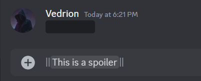
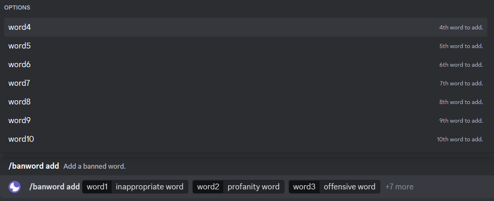
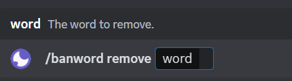
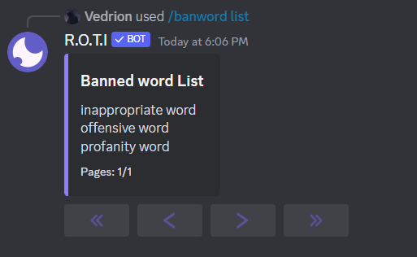
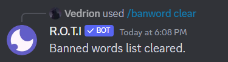

import { Steps } from 'nextra/components'
import { Callout } from 'nextra/components'

# AutoMod

R.O.T.I's AutoMod system empowers you to proactively maintain a friendly and organized Discord community.  With customizable filters, targeted actions, and flexible configuration, you can automate the moderation of common issues, saving you time and ensuring a positive experience for everyone.

## Commands

| Command         | Description                           | Usage                    |
| --------------- | ------------------------------------- | ------------------------ |
| /automod        | Enables automatic moderation features | `/automod`               |
| /banword add    | Add word to ban                       | `/banword add [word]`    |
| /banword remove | Remove banned words                   | `/banword remove [word]` |
| /banword list   | List all banned words                 | `/banword list`          |
| /banword clear  | Clear all banned words                | `/banword clear`         |

## Automod Filters

<Callout type="info">
The punishment for violating these filters (warning, timeout, etc.) is configurable by admins.
</Callout>

<Steps>
### Discord Invite Filter

Prevents members from poaching users or advertising other Discord servers without authorization. AutoMod blocks any message containing an invite link to another server, helping maintain focus on your own community and preventing potential disruptions.

```bash
Example: A user posts "Join my Minecraft server! [invite link]."
```
AutoMod deletes the message and issues a punishment (determined by admins).

### Link Filter

Gives you control over the posting of external website links. Helps combat spam, unsolicited self-promotion, and potentially malicious links. It includes a whitelist feature, so you can allow links to trusted domains like YouTube or official news sites while still filtering out potentially harmful or disruptive content.

```bash
Example: A user tries to post a link to their new mixtape download site.
```
The message is blocked and issues a punishment (determined by admins). If youtube.com is whitelisted, they are still able to share YouTube music videos.

### Spam Mention Filter Threshold

Detects and acts upon users who repeatedly mention multiple other members within a short time frame. Protects users from being bombarded with unwanted pings, targeted harassment, or general attempts to annoy others.

```bash
Example: A user posts 5 messages within a minute, each mentioning 4 different members.
```
AutoMod deletes the message and issues a punishment (determined by admins).

### Spam Emoji Filter Threshold

This filter helps control excessive emoji use by deleting messages that surpass a customizable emoji limit. The admin sets the desired maximum number of emojis allowed in a single message.

<Callout emoji="🤖">
This filter primarily targets custom server emojis or emojis from external sources. It does not apply to Discord's standard set of emojis.
</Callout>

### Sticker Filter

Gain direct control over sticker usage on your server. Manage your server's stickers with precision, and block or restrict stickers to foster a positive and focused chat environment.

### Ban Words Filter

Automatically removes or warns about messages that contain offensive or harmful language. Define a list of banned words or phrases by using `/banword` command to maintain a respectful and inclusive environment within your Discord community.

```bash
Example: A user message includes a racial slur on your ban list.
```
The filter instantly deletes their message and issues a punishment (determined by admins).

### Wall of Text Filter

Improves the readability of your chat channels by catching excessively long, unformatted messages that could dominate the conversation. Encourages users to break down their thoughts into smaller messages or utilize paragraphs.

```bash
Example: Someone pastes a 500 word rant without line breaks.
```
AutoMod deletes the message and asks them to try sending shorter messages. Admins can set the maximum character count allowed before the filter takes action.

### Caps Filter

Promotes a calmer and more welcoming chat atmosphere by deleting messages written primarily in capital letters and exceeding a certain length (usually around 10 characters). Helps prevent the feeling that people are shouting at each other, preserving a more conversational tone.

```bash
Example: A user types "THIS IS SO UNFAIR!!!"
```
AutoMod deletes their message.

### Spoiler Filter

The Spoiler Filter is a feature designed to automatically delete messages that include spoiler text or spoiler attachments. This functionality ensures that any content containing spoilers is promptly removed, maintaining a spoiler-free environment within your Discord server.

Spoilers are represented by enclosing text between double vertical bars `||`, such as `||Hello||`, which effectively hides the content and covers it with a black strip.



### Ignored Channels

This setting allows you to select specific chat channels where the moderation filters will not be active.

You might create a dedicated channel where people can discuss plot twists freely, or an "off-topic" channel for conversations that don't fit elsewhere.

### Ignored Roles

This setting lets you choose roles (like "Moderator" or "Trusted Member") whose users will not be targeted by the moderation filters.

This can be useful to give trusted members more freedom in their conversations or to ensure that a moderator's actions aren't accidentally flagged by the filters.

### Ignored Users

This setting allows you to select specific users who are not affected by these filters.

This setting might be used to exempt important individuals like guests or to handle special circumstances on a case-by-case basis.

### Warning Threshold

This filter determines how many times user can break the rules before receiving an automatic punishment.

The warning threshold gives user a chance to adjust their behavior after a minor mistake before facing serious consequences.

### Punishment Timeout

This setting controls the length of time that a punishment (timeout) will be in effect.
</Steps>

## Banwords

Take control of your chat! Create a custom list of banned words and phrases to automatically filter unwanted content and protect your members from harmful or offensive language.

### Add Banwords

`/banword add` command adds a specified word to the banned word list. Messages containing this word will be automatically deleted.

- `[word]` (Required): The word to be banned.

```bash filename="Usage"
/banword add [word1] [word2] ...
```


### Delete Banword

Removes a specified word from the banned word list. Messages containing this word will no longer be filtered.

- `[word]` (Required): The word to be removed from the ban list.

```bash filename="Usage"
/banword remove
```


### List Banwords

Displays a complete list of all currently banned words.

```bash filename="Usage"
/banword list
```


### Clear Banword List

Removes all words from the banned word list.

```bash filename="Usage"
/banword clear
```


## <span className="txp">Conclusion</span>

With AutoMod, you have total control over your chat experience. Decide what kind of language and behavior is allowed, set clear consequences, and let AutoMod handle the day-to-day moderation. This frees up you and your moderators to focus on building a strong and welcoming community.

Key Points:

- `Customization`: You decide what's acceptable and what's not.
- `Automation`: AutoMod handles the enforcement, saving you time.
- `Focus`: You can prioritize community building instead of constant moderation.