import { User } from 'lucide-react'
import { Steps } from 'nextra/components'
import { Callout } from 'nextra/components'

# Moderation

Empower your community by ensuring everyone's safety, cultivating a friendly atmosphere, and shaping the space with moderation commands and filters that you can adjust. Customize the moderation experience to meet your community's specific needs, creating a secure and welcoming environment. Implement various commands and filters to maintain community standards, regulate user interactions, and establish a positive and enjoyable atmosphere for all.

## Commands

<details>
  <summary>Moderation Commands</summary>

| Command             | Description                                                        | Usage                                                       |
| ------------------- | ------------------------------------------------------------------ | ----------------------------------------------------------- |
| /ban                | Ban a user from the server even if they are not currently a member | `/ban [user] [delete_message_days] [reason]`                |
| /case               | Get information about a specific case                              | `/case [user] [log_id]`                                     |
| /clearwarns         | Delete all warnings of a user                                      | `/clearwarns [user]`                                        |
| /decancer           | Removes zalgo characters from a user's name                        | `/decancer [user]`                                          |
| /delwarn            | Deletes a warning from user record                                 | `/delwarn [user] [warning_id]`                              |
| /duration           | Change the duration of a mute/ban                                  | `/duration [user] [duration]`                               |
| /emoji add          | Add custom emoji to your server                                    | `/emoji add [emoji] [name]`                                 |
| /emoji addmany      | Add multiple custom emojis to the server                           | `/emoji addmany [emojis]`                                   |
| /emoji pack         | Search and add emojis from emoji.gg                                | `/emoji pack [search]`                                      |
| /emoji list         | List all the emojis currently available on your server             | `/emoji list [search]`                                      |
| /kick               | Kick a member from the server                                      | `/kick [user] [reason]`                                     |
| /lock               | Lock a channel to prevent messages from being sent                 | `/lock [channel] [target] [duration]`                       |
| /massban            | Ban multiple users from the server                                 | `/massban [users] [reason] [delete_message_days]`           |
| /modlogs            | Displays moderation logs for a user                                | `/modlogs [user]`                                           |
| /nickname           | Change the nickname of a user                                      | `/nickname [user] [nickname]`                               |
| /note set           | Set note for a specific user                                       | `/note set [user] [note]`                                   |
| /note list          | Displays a list of all notes                                       | `/note list`                                                |
| /note clear         | Clear all notes for a specific user                                | `/note clear [user]`                                        |
| /note get           | Get all notes for a specific user                                  | `/note get [user]`                                          |
| /note remove        | Remove note(s) for a specific user                                 | `/note remove [user] [note_id]`                             |
| /note removeall     | Remove all your notes                                              | `/note removeall`                                           |
| /permission enable  | Enable a message command for a channel                             | `/permission enable [command] [channel]`                    |
| /permission disable | Disable a message command for a channel                            | `/permission disable [command] [channel]`                   |
| /purge              | Delete a specified number of messages from a channel               | `/purge [amount] [options]`                                 |
| /reason             | Change the reason of a moderation action                           | `/reason [user] [log_id] [reason]`                          |
| /removetimeout      | Remove timeout from a user                                         | `/removetimeout [user]`                                     |
| /timeout            | Timeout a user for a certain amount of time                        | `/timeout [user] [duration] [reason]`                       |
| /say                | Sends your message from anyone to anywhere                         | `/say [text] [channel] [user]`                              |
| /slowmode           | Set slowmode for a channel                                         | `/slowmode [time] [channel] [reason] [duration]`            |
| /softban            | Softban a user from the server                                     | `/softban [user] [delete_message_days] [reason]`            |
| /sticker add        | Add a custom sticker to the server                                 | `/sticker add [url] [name] [tags] [description]`            |
| /tempban            | Temporarily ban a user from the server                             | `/tempban [user] [duration] [delete_message_days] [reason]` |
| /unban              | Unban a member from the server                                     | `/unban [user] [reason]`                                    |
| /unlock             | Unlock a channel                                                   | `/unlock [channel] [target]`                                |
| /voicemove          | Move all users from a voice channel to another                     | `/voicemove [from] [to]`                                    |
| /warn               | Warn a user                                                        | `/warn [user] [reason]`                                     |
| /warnings           | Displays all the warnings of a user                                | `/warnings [user]`                                          |

</details>

**Key Concepts & Terminology**

- `User`: A member of your server.
- `Channel`: A designated space for text or voice communication within your server.
- `Reason`: An explanation for a moderation action (ban, warn, etc.).
- `Duration`: The length of time a punishment (timeout, ban) will last.
- `Delete Message Days`: An option for bans that specifies how many days of a user's message history to delete.

## Core Commands

<Steps>

### Banning a User

Permanently bans a user from your Discord server. This action cannot be reversed unless manually unbanned by a moderator.

```bash filename="Usage"
/ban [user] [delete_message_days] [reason]
```
**Example:**

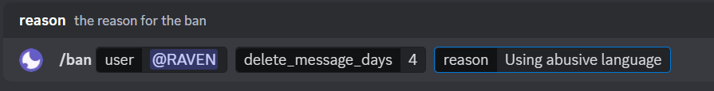

### Kicking a User

Removes a user from the server. Unlike banning, they can rejoin if they have an invite link.

```bash filename="Usage"
/kick [user] [reason]
```
**Example:**

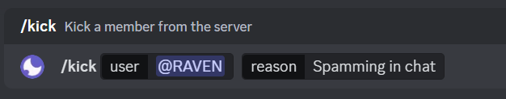

### Timeout

Restricts a user from participating in voice channels and chatting in text channels for a specified duration. It serves as a typical disciplinary measure for addressing disruptive behavior in both voice and text chat interactions.

```bash filename="Usage"
/timeout [user] [duration] [reason]
```
**Example:**

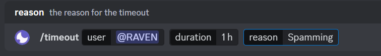

### Warning a User

Issues a formal warning to a user. Warnings are tracked as part of their moderation history.

```bash filename="Usage"
/warn [user] [reason]
```
**Example:**

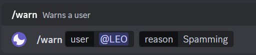

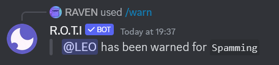

### Voice Move

Efficiently moves all members from one voice channel to another voice channel on your Discord server.

```bash filename="Usage"
/voicemove [from] [to]
```
**Options:**

- `[from]`: The current voice channel where users are located.
- `[to]`: The voice channel where you want to move the users.

**Example:**


### Revoke Ban

Reverses a ban on a user, allowing them to rejoin the server.

```bash filename="Usage"
/unban [user] [reason]
```
**Example:**

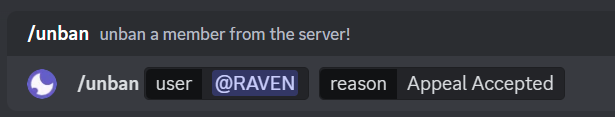

### Remove Timeout

Removes an active timeout from a user, allowing them to participate in voice & text chat again.

```bash filename="Usage"
/removetimeout [user]
```
**Example:**


### Deleting Messages

The `/purge` command allows you to bulk delete messages in a channel based on specified criteria, helping to maintain a clean and organized chat environment.

```bash filename="Usage"
/purge [amount] [options]
```
**Options:**

These options can be applied to delete messages from specific users or those containing specific words, and more.

- `channel`: Specifies the channel from which messages should be deleted.
- `user`: Deletes messages only from a specific user.
- `link`: Deletes messages containing URLs or links.
- `invite`: Deletes messages containing invite links.
- `contain`: Deletes messages containing specific text.
- `bot`: Deletes only messages sent by bots.
- `human`: Deletes only messages sent by humans.
- `regex`: The regex filter allows you to delete messages based on a provided regular expression (regex). Regular expressions are powerful patterns that describe text. The regex filter is case-sensitive and supports fuzzy search.

If no filters are provided, the command will purge the specified amount of messages without any additional conditions.

**Example:**

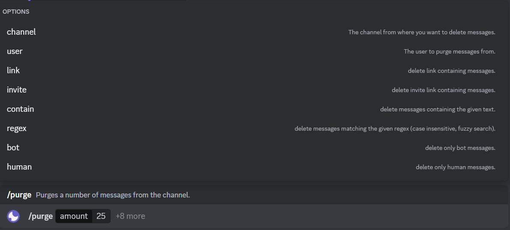

</Steps>

## Advanced Moderation

<Steps>

### Mass Banning

Bans multiple users at once from a server.

```bash filename="Usage"
/massban [users] [reason] [delete_message_days]
```
**Example:**

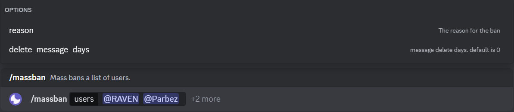

<Callout type="error" emoji="💀">
It's best to verify the list of users carefully before executing this command.
</Callout>

### Soft Ban

Kicks a user from the server and then immediately unbans them. This is often used to clear their recent message history. By default, it deletes user messages from the last 7 days.

```bash filename="Usage"
/softban [user] [delete_message_days] [reason]
```
**Example:**

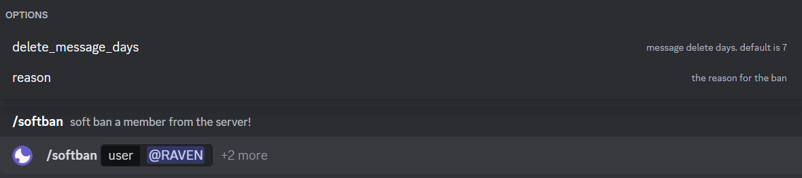

### Temporary Ban

Bans a user for a specified amount of time. After the duration expires, the ban is lifted automatically.

```bash filename="Usage"
/tempban [user] [duration] [delete_message_days] [reason]
```
**Example:**

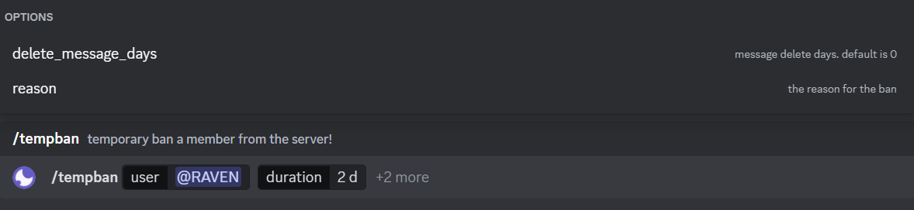

</Steps>

## Moderation Management

<Steps>
### Viewing Moderation Logs

Displays a history of moderation actions taken against that user (bans, kicks, warnings, etc.).

```bash filename="Usage"
/modlogs [user]
```
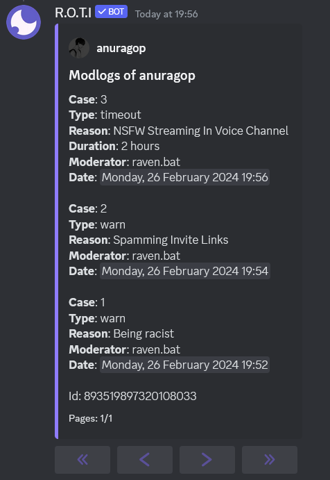

### Retrieving Case Information

Retrieves specific details about a past moderation action taken against a user. The log ID can be found using the `/modlogs` command.

```bash filename="Usage"
/case [user] [log_id]
```
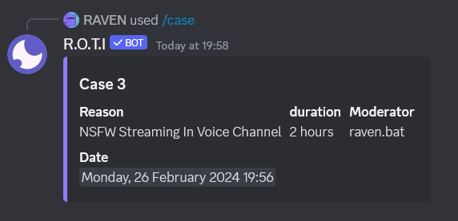

### Updating Moderation Reasons

Updates the reason for a past moderation action. Use the log ID provided from the `/modlogs` command.

```bash filename="Usage"
/reason [user] [log_id] [reason]
```


### Adjusting Punishment Durations

Adjusts the length of an existing ban or timeout. Use this if you need to shorten or lengthen a temporary punishment.

```bash filename="Usage"
/duration [user] [duration]
```
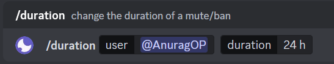

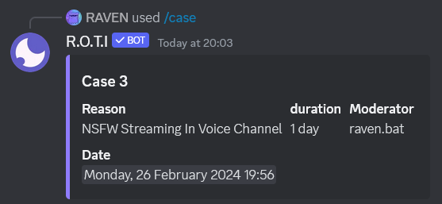

</Steps>

## Managing Warnings

<Steps>
### Checking Warnings

Displays a list of all warnings a user has received.

```bash filename="Usage"
/warnings [user]
```
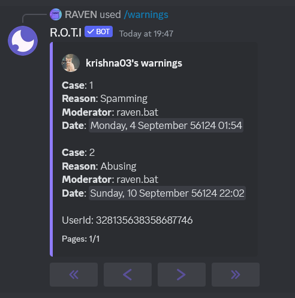

### Clearing Warnings

Clears the entire warning history for a specified user.

```bash filename="Usage"
/clearwarns [user]
```
**Example:**

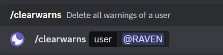

### Deleting Warnings

Removes a specific warning from a user's record (use the warning ID obtained from `/warnings`).

```bash filename="Usage"
/delwarn [user] [warning_id]
```
**Example:**

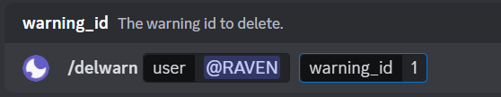
</Steps>

## Fun and Informative

### Sending Messages as Others

Sends a message that appears to be from another user. Use responsibly, as it can be misused to impersonate others.

```bash filename="Usage"
/say [text] [channel] [user]
```
**Example:**

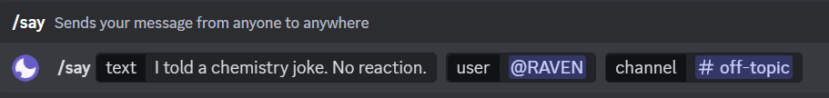


## Permission Management

By using the `/permission` command, you can enable or disable message commands (which are executed using a prefix) only. If you want to enable or disable slash commands, refer to the guide [here](/faq#how-to-enable-or-disable-a-command-in-roti-).

<Steps>
### Enabling Commands in Channels

Allows the specified command to be used in a particular channel.

```bash filename="Usage"
/permission enable [command] [channel]
```

### Disabling Commands in Channels

Prevents a command from being used in a particular channel.

```bash filename="Usage"
/permission disable [command] [channel]
```
<Callout emoji="⚠️">
If no channel is specified, the command will be enabled/disabled in all channels.
</Callout>

</Steps>

## Customization

<Steps>
### Adding a Emoji

Adds a new emoji to your server.

```bash filename="Usage"
/emoji add [emoji] [name]
```
The 'emoji' input can be in the following formats:

1. **An actual emoji from another server (Nitro required):**

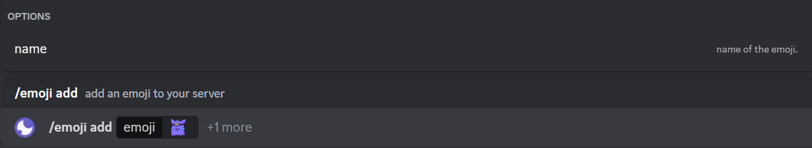

2. **Using Emoji URL:**

```bash
/emoji add [https://cdn.discordapp.com/emojis/1098795083542822953.png] [roti_emoji]
```


3. **Using Emoji ID:**

```bash
/emoji add [1098795055633932418] [roti_emoji_2]
```


### Adding Multiple Emojis

Uploads multiple emojis to your server.

```bash filename="Usage"
/emoji addmany [emojis]
```
**Example:**

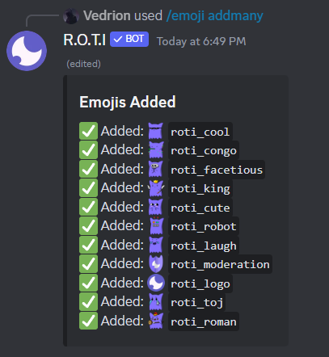

### Emoji Pack

Searches for emojis on emoji.gg and lets you add them directly to your server.

```bash filename="Usage"
/emoji pack [search]
```
**Example:**

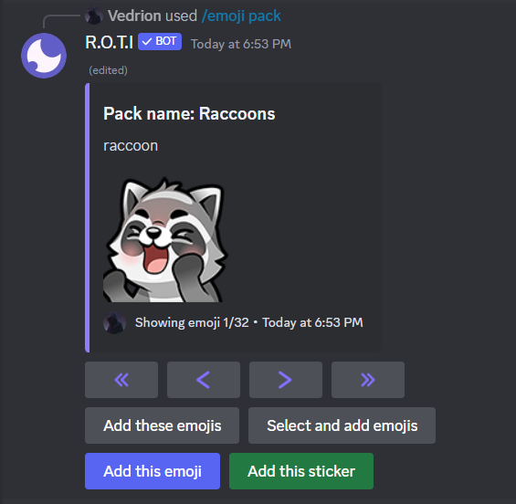

### Listing Server Emojis

Lists all custom emojis available on the server. Optionally, you can add a search term to find a specific emoji by name.

```bash filename="Usage"
/emoji list [search]
```
**Example:**

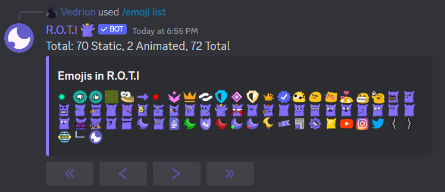

### Adding Stickers

Uploads a custom sticker to your Discord server.

```bash filename="Usage"
/sticker add [url] [name] [tags] [description]
```
**Example:**


</Steps>

## Utility Commands

<Steps>
### Removing Zalgo Characters

Removes "Zalgo" characters from a user's nickname. Zalgo characters are often used to distort or make usernames difficult to read. The result may not be entirely accurate, but it attempts to decancer to the best possible representation.

```bash filename="Usage"
/decancer [user]
```
**Example:**

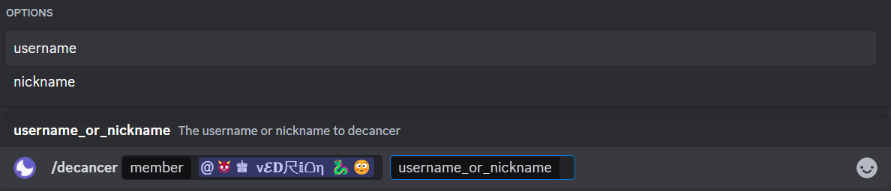

### Changing Nicknames

Changes a user's displayed nickname on the server.

```bash filename="Usage"
/nickname [user] [nickname]
```
**Example:**

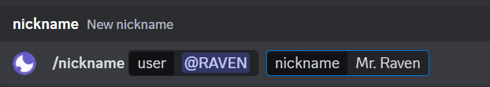

</Steps>

## Channel Management

<Steps>
### Locking Channels

Prevents anyone from sending messages in a channel. Useful for temporarily restricting conversation during announcements or incidents.

```bash filename="Usage"
/lock [channel] [target] [duration]
```
<Callout type="info">
If no channel is specified, the current channel will be locked.
</Callout>

**Options:**

- `[target]`: Restricts the lock to a specific role or user.
- `[duration]`: Specifies a timeframe after which the channel will automatically unlock.

**Example:**

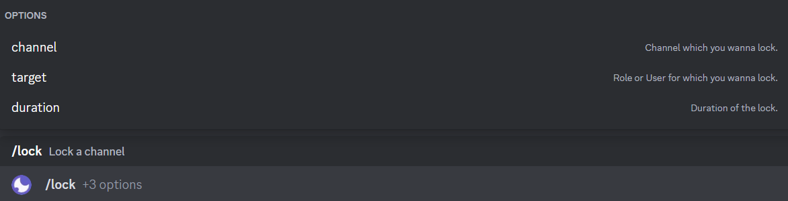

### Unlocking Channels

Removes a lock from a channel, allowing members to chat again.

```bash filename="Usage"
/unlock [channel] [target]
```
**Options:**

- `[target]`: Unlock channel for a specific role or user.

**Example:**

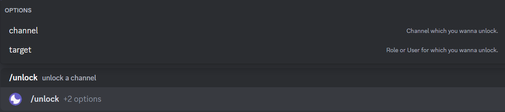

### SlowMode

Enforces a cooldown period between messages in a channel. Helps prevent spam or overly rapid conversations.

```bash filename="Usage"
/slowmode [time] [channel] [reason] [duration]
```
- `[time]`: The interval between messages **(in seconds)** that members must wait before sending another message.

<Callout type="info">
To disable slow mode, use the `/slowmode` command again and set the time to 0.
</Callout>

**Options:**

- `[channel]`: The specific text channel where slowmode will be applied.
- `[reason]`: An explanation for why you are implementing slowmode.
- `[duration]`: Determine how long the slowmode will remain in effect.

**Example:**

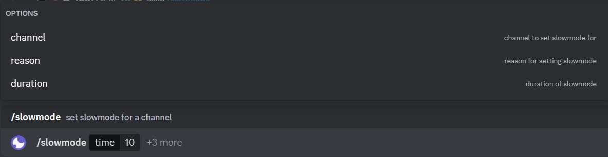

</Steps>

## Moderator Notes

<Steps>
### Adding a Note

Adds a private note to a user, visible only to moderators with appropriate permissions.

```bash filename="Usage"
/note set [user] [note]
```
**Example:**

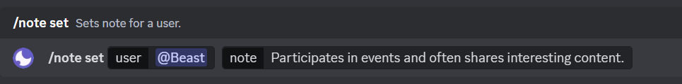

### Listing Notes

Displays a list of all existing notes on the server.

```bash filename="Usage"
/note list
```
**Example:**

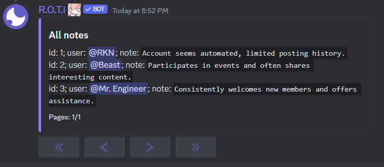

### Get User Notes

Retrieves all notes associated with a specific user.

```bash filename="Usage"
/note get [user]
```
**Example:**

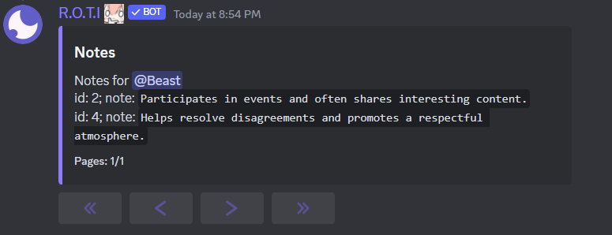

### Clearing Notes

Deletes all notes associated with a specific user.

```bash filename="Usage"
/note clear [user]
```
**Example:**

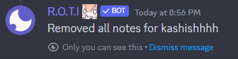

### Removing a Note

Removes a specific note of a user by its ID.

```bash filename="Usage"
/note remove [user] [note_id]
```
**Example:**

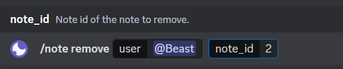

### Remove All Notes

Remove all existing notes on the server.

```bash filename="Usage"
/note removeall
```
</Steps>

## <span className="txp">Conclusion</span>

Your Discord server should be a place where members feel comfortable and enjoy spending time. Moderation plays a key role in shaping that experience. Use these commands strategically to create a welcoming and engaging environment for your community.