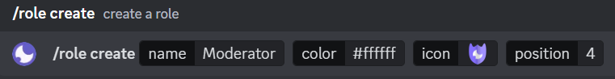
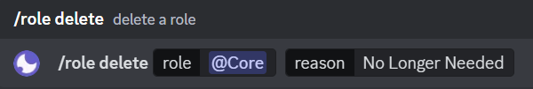
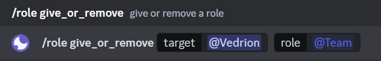
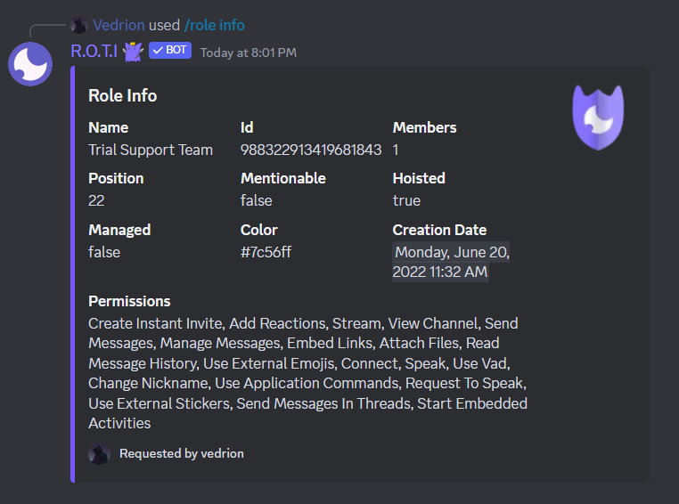
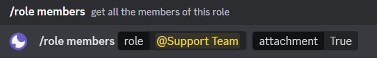
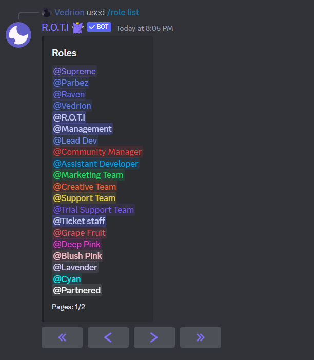
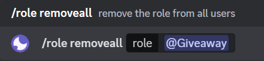

import { Steps } from 'nextra/components'
import { Callout } from 'nextra/components'

# Role Administration

R.O.T.I's role management commands are designed for ease of use and flexibility. Create interactive buttons and dropdown menus for role assignment, add engaging reaction-based roles, and even assign temporary roles for events or promotions. With these commands, you'll transform your Discord server into a dynamic and welcoming space, with minimal effort on your part.

## Commands

<details>
  <summary>Role Commands</summary>

| Command                 | Description                                                            | Usage                                                             |
| ----------------------- | ---------------------------------------------------------------------- | ----------------------------------------------------------------- |
| /buttonrole             | Create a button that assigns a role to a user when clicked             | `/buttonrole [channel] [type]`                                    |
| /selectrole             | Create a dropdown menu that allows users to assign themselves a role   | `/selectrole [channel] [type]  [require_role_type] [placeholder]` |
| /reactionrole add       | Add a role to a message that can be assigned to users when reacted     | `/reactionrole add [message_id] [channel]`                        |
| /reactionrole remove    | Remove a reaction role that was previously assigned through a reaction | `/reactionrole remove [message_id] [emoji] [channel]`             |
| /reactionrole removeall | Remove all reaction roles that were assigned through reactions         | `/reactionrole removeall  [channel] [message_id]`                 |
| /temprole               | Assign temporary role to a user                                        | `/temprole [target] [role] [duration]`                            |
| /role create            | Create a new role                                                      | `/role create [name] [color] [icon] [position]`                   |
| /role delete            | Delete an existing role                                                | `/role delete [role] [reason]`                                    |
| /role update            | Assign or revoke a role from user                                      | `/role update [target] [role]`                                   |
| /role info              | Display information about a role                                       | `/role info [role]`                                               |
| /role members           | Display a list of members who have been assigned a specific role       | `/role members [role] [attachment]`                               |
| /role list              | Display a list of all roles in the server                              | `/role list [filter]`                                             |
| /role removeall         | Remove a role from all users                                           | `/role removeall [role]`                                          |

</details>

## Temporary Roles

Temporary roles offer a way to grant roles to users for a limited duration. Temporary roles are perfect for situations where you want to grant access, highlight a user, or provide a special status for a set period of time.

```bash filename="Usage"
/temprole [target] [role] [duration]
```
Options:

- `[target]`: The user you want to give the temporary role to.
- `[role]`: The role you want to assign temporarily.
- `[duration]`: How long the role should last.

The assigned role will be automatically removed from the user once the specified duration has passed.


## Creating a New Role

Create a brand-new role to organize your server. Carefully choose a name, color, and optional icon to reflect the role's purpose or status. You can even determine where it appears in your server's role hierarchy.

```bash filename="Usage"
/role create [name] [color] [icon] [position]
```
Options:

- `[name]`: The name of your role.
- `[color]`: Choose a color to visually distinguish the role.
- `[icon]`: Include an emoji or image associated with the role.
- `[position]`: Determine where the role appears in the list.



## Deleting an Existing Role

If a role is no longer needed or becomes outdated, remove it from your server entirely. This helps keep your role list organized and prevents confusion for members.

```bash filename="Usage"
/role delete [role] [reason]
```
Options:

- `[role]`: The role you want to delete.
- `[reason]`: Provide an explanation for the removal.



## Updating User Roles

Grant a specific role to a user to give them access to certain channels, abilities, or recognition within your server. Additionally, you can remove a role to adjust their level of participation.

```bash filename="Usage"
/role update [target] [role]
```
Options:

- `[target]`: The user whose role you want to modify.
- `[role]`: The role you want to add or remove from the user.



## Getting Role Information

The `/role info` command provides a comprehensive breakdown of a specific role on your server. This is helpful for understanding the role's function within your community.

```bash filename="Usage"
/role info [role]
```
Options:

- `[role]`: The role you want information on.

Simply specify the role you're interested in, and you'll receive the following details

- `Name`: The name of the role.
- `ID`: The unique identifier for the role.
- `Members`: The number of server members who currently have this role.
- `Position`: Where the role appears in the server's role hierarchy (higher positions are closer on the list).
- `Mentionable`: Whether the role can be mentioned (using @role) to notify its members.
- `Hoisted`: If the role is displayed separately in the members list.
- `Managed`: Whether the role is created or managed by an integration or bot.
- `Color`: The visual color associated with the role.
- `Creation Date`: When the role was created.
- `Permissions`: A list of specific permissions granted by this role.



## Viewing Role Members

See a complete list of everyone on your server who has been assigned a particular role. This can be useful for checking participation, managing events, or understanding how a role is being used.

```bash filename="Usage"
/role members [role] [attachment]
```
Options:

- `[role]`: The role to check.
- `[attachment]`: Creates a downloadable file with the member list.



## Listing All Roles

View a full list of all roles that exist on your server. This provides a snapshot of how roles are being used to structure your community.

```bash filename="Usage"
/role list [filter]
```
Options:

- `[filter]`: Enter name to narrow down the list to roles containing that name.



## Mass Role Removal

⚠️ Use with caution! This command removes a designated role from every single user on your server. This might be necessary for restructuring, or if a role becomes obsolete.

```bash filename="Usage"
/role removeall [role]
```
Options:

- `[role]`: The role you want to remove from everyone.



## Button Roles

Button roles provide a clickable and interactive way for users to assign or remove roles from themselves within your server.

To access the complete documentation for **Button Roles**, including detailed instructions and examples, please navigate to the **Basic Configuration** category. Use the following URL or [click here](/basic-configuration/self-roles#create-button-roles) to explore the documentation for the `/buttonrole` command:

```
https://docs.rotibot.xyz/basic-configuration/self-roles#create-button-roles
```

## Select Roles

Select menus streamline role assignment by allowing users to choose their desired roles from easy-to-use dropdown menus.

To access the complete documentation for **Select Roles**, including detailed instructions and examples, please navigate to the **Basic Configuration** category. Use the following URL or [click here](/basic-configuration/self-roles#create-dropdown-roles) to explore the documentation for the `/selectrole` command:

```
https://docs.rotibot.xyz/basic-configuration/self-roles#create-dropdown-roles
```

## Reaction Roles

Reaction roles add a touch of fun by letting members assign or remove roles by simply reacting to designated messages with specific emojis.

To access the complete documentation for **Reaction Roles**, including detailed instructions and examples, please navigate to the **Basic Configuration** category. Use the following URL or [click here](/basic-configuration/self-roles#create-reaction-roles) to explore the documentation for the `/reactionrole` command:

```
https://docs.rotibot.xyz/basic-configuration/self-roles#create-reaction-roles
```
## <span className="txp">Conclusion</span>

Whether you're an admin or a regular member, R.O.T.I. has your back when it comes to roles.  Create new roles, assign them, remove them, or just check out what a role is all about. Role management doesn't have to be complicated!
